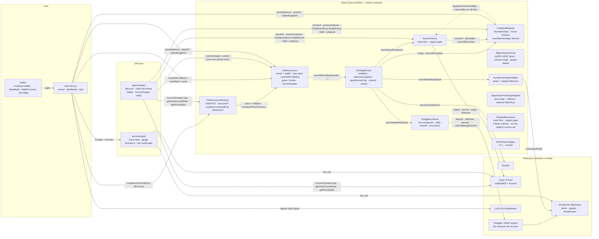

# Architecture — Base module v1 (the Solana module is designed in `SOLANA-ARCHITECTURE.md`)

What is in the tree on 2026-09-06, after the wave-1 audit and fix round, and
what enforces each claim. Anything labelled **plan** is not built. Addresses
are only those in `VERIFIED-BASE-FACTS.md` (read live 2026-09-05, with the
2026-09-06 addendum that added the Aerodrome Slipstream SwapRouter and
Multicall3).

Abbreviations: HF = health factor; LT = liquidation threshold; LTV =
loan-to-value; LP = liquidity provision; APR = annual percentage rate; ABI =
application binary interface; RPC = remote procedure call; TWAP = time-weighted
average price; EOA = externally owned account; EIP = Ethereum Improvement
Proposal; MC = Monte Carlo.

## The shape

The user's wallet owns an **OilskinAccount** (one EIP-1167 clone per wallet;
EIP is an Ethereum Improvement Proposal). Every position — Aave v3 collateral
and debt, Snuggle-engine LP (liquidity-provision) ids — belongs to that
account. Oilskin's other contracts are **peripherals** the account calls; they
instruct the account, hold nothing, and have no admin. Off-chain, a **keeper**
watches each account's Aave health factor (HF) and may act only inside a grant
the owner signed. The **yield service** decides which pools may be offered. The
**web** encodes exactly the calls below and asks the wallet to sign them.

Two facts about that shape changed in the fix round and shape everything below:

1. **Peripheral rights are opt-in per call.** A call from the account grants
   the target nothing unless `Call.callback` is set (owner path) or
   `Permission.allowCallback` is set in the grant (keeper path). `exec` is now
   a plain call; `execWithCallback` is the opt-in.
2. **The entry health-factor floor lives at the venue, not at one router
   function.** `AaveV3Venue.borrow` reverts `EntryHfTooLow` itself, so no
   sequence through the Oilskin venue — router, hand-built batch, keeper —
   can open debt below the floor.

## Accounts (`contracts/src/account/`)

**OilskinAccount** (642 lines). `owner` is set once by `initialize`, which only
the factory can call and only once (`NotFactory`, `AlreadyInitialized`); the
implementation contract is bricked at construction (`owner = address(1)`).
The doors:

- `exec(target, value, data)` — owner only (`NotOwner`), and now a **plain**
  call: the target gets no rights over the account. This is what a token
  `approve`, a pool read-write or a Permit2 call should use.
- `execWithCallback(target, value, data)` — owner only; the target becomes the
  *active peripheral* for the duration of the call. Required for the router,
  the venues and the swap adapter, which must instruct the account back.
- `execBatch(calls)` — owner only, atomic; each `Call` carries its own
  `callback` flag, so one batch can mix a plain token call with a peripheral
  call.
- `execAsKeeper(calls)` — anyone may call, but each root call must match an
  active grant for `msg.sender` (`NotGranted`). **The `callback` flag on the
  call is ignored here**: the account reads `Permission.allowCallback` from the
  grant, so the owner — never the keeper — decides which target may act back
  on the account. Every ETH value and every recognised token operation
  anywhere in the tree (`transfer`, `approve`, `increaseAllowance`,
  `transferFrom`, Permit2 `approve` / single `transferFrom`) is charged to the
  grant's per-period budgets (`_charge`, `_decodeTokenOp`; `TokenNotBudgeted`,
  `TokenBudgetExceeded`, `ValueBudgetExceeded`). Budgets are computed from
  **calldata amounts**, never balance snapshots, so a rebasing token cannot
  fool them. Token movers the parser cannot read — Permit2 batch
  `transferFrom`, Permit2 `permitTransferFrom` (single and batch), ERC-777
  `send`, ERC-677 `transferAndCall` — are **refused** on the keeper path with
  `UnbudgetableSelector(target, selector)` rather than passing free. The owner
  path may still use all four.
- `execFromPeripheral(calls)` / `execNestedPeripheral(peripheral, value, data)`
  — only the active peripheral, only while a callback-enabled call is in
  flight (`NotActivePeripheral`); a call handed to `execFromPeripheral` that
  asks for rights reverts `CallbackNotPermitted()`; nesting is bounded at
  `MAX_PERIPHERAL_DEPTH = 8` (`PeripheralDepthExceeded`; the real composition,
  router → venue, is 2). This is how a venue makes the *account* `msg.sender`
  to Aave or the engine.
- `execBatchFromFactory(owner, calls)` — FACTORY-only forwarder, refused unless
  `msg.sender == FACTORY` and the passed owner is the real owner. It exists so
  `createAccountAndExec` still works when someone front-ran the clone.

Per-call context (lock, actor, active peripheral, peripheral depth, root
grant) lives in transient storage (EIP-1153), so nothing about a call survives
the transaction; re-entry through any door reverts `Reentrancy`. Revert data
bubbles untouched (`_rawCall`).

Grants: `grant(keeper, Permission{target, selector, maxValuePerPeriod,
tokenLimits[≤8], period, expiry, allowCallback})`, `revoke(keeper, target,
selector)` — which reverts `NotRevocable` on a key that was never granted, so
a watcher can tell a kill switch from a no-op — and `revokeAll()` (an epoch
bump that kills every grant). Rejected at grant time: a zero selector (it was
a blanket permit for any call with fewer than four bytes of calldata,
including a bare ETH send), a token limit of zero, and duplicate tokens.
**A re-grant inside a live period carries the spend forward** — every
token's, listed again or not (wave 3, W3-LOW-7) — instead of refilling the
window, so "1,000 USDC per day" means that. `grantOf` returns
seven values including `allowCallback`, and both `grantOf`'s `valueSpent` and
`tokenBudgetOf`'s `spent` apply the period roll in the view, so a client never
sees a number the chain would not enforce. ERC-721/1155 receivers and
`receive()` are implemented. No admin, no upgrade, no fee logic.

**OilskinAccountFactory** (81 lines). `accountOf(owner)` is a pure function of
the factory and owner (`Clones.predictDeterministicAddress`), so the web can
show the account address — and use it as the Permit2 spender — before it
exists. `createAccount(owner)` is idempotent and refuses `address(this)`
(`InvalidOwner`); `createAccountAndExec(calls)` deploys the *caller's* account
if needed and runs `calls` as its owner in the same transaction —
**idempotent since the fix round**: an account someone else already deployed
for this owner is used, and the batch is forwarded through
`execBatchFromFactory`. `AccountExists` is gone. Emits
`AccountCreated(owner, account)` — the keeper's discovery source.

## Venues (`contracts/src/venues/`, interfaces in `src/interfaces/`)

`ICollateralVenue { supply, withdraw, borrow, repay, healthFactor,
liquidationThresholdBps, maxLtvBps, debt, collateral, borrowRateRay, enabled }`
— unchanged in shape.

- **AaveV3Venue** (189 lines) — no storage, no admin; constructed with the
  `PoolAddressesProvider` **and the registry**. Resolves the pool, data
  provider and oracle through the provider on every call; reads liquidation
  threshold (LT) and LTV (loan-to-value) from `getReserveConfigurationData` at
  call time — nothing is a constant. Policy now lives on the entry side of
  this contract:
  - `supply` refuses an asset the registry does not point at *this* venue, or
    has disabled (`AssetNotOffered(asset, venue)`). That is what keeps cbZEC
    out the day Aave lists it.
  - `borrow` reads the account's **global** health factor from Aave after the
    borrow and reverts `EntryHfTooLow(hf, floor)` below
    `REGISTRY.entryHfFloorWad()`. Every path that borrows through the venue
    passes through it.
  - `withdraw` and `repay` consult nothing: an exit is never gated.

  `supply` is `approve(exact) → Pool.supply(asset, amount, account, 0) →
  approve(0)` (`Peripheral._approveCallReset`), `borrow` is variable-rate with
  `onBehalfOf` = the account, `repay` approves `min(amount, owed)`, `withdraw`
  pays the account. E-mode is not used.
- **MorphoBlueVenue** — the same interface over Morpho Blue's two Base USDC
  markets (cbBTC/USDC and WETH/USDC, 86 % LLTV, ids read from the chain
  2026-09-07 — `VERIFIED-BASE-FACTS.md`). Built over a fixed id list at
  construction (each id re-read from `idToMarketParams` and re-hashed); no
  admin, no add-market function. Same entry-side policy as Aave: `supply`
  checks the registry's offer, `borrow` checks the floor against the WORST
  market (positions are isolated per market). `liquidationThresholdBps` and
  `maxLtvBps` both return the live LLTV — Morpho has one threshold. Debt is
  computed as Morpho will accrue it (`libraries/MorphoMath.sol`), so
  `repay(max)` closes every market by shares. Deployed alongside Aave but
  **not** the registry's venue for anything: moving cbBTC or WETH to it is
  `proposeVenue` → timelock → `acceptVenue`. With no market ids (Base Sepolia)
  it reports `enabled() == false`.

`ILpVenue { open, increase, close, closeMany, claim, positionsOf, poolTokens,
poolOf }` → **SnuggleLpVenue** (651 lines) over the live MaxFi/Snuggle engine
proxy `0x7D27CDfBFcC878F7E7349e216d44204BFd2AFd55`:

- Every id is minted to the calling account (the account is `msg.sender` to the
  engine); every token movement is instructed back into the account.
- Width is the **total tick span** in `[150, 5000]` (`MIN_WIDTH_BPS`,
  `MAX_WIDTH_BPS`, `InvalidWidth`); delay ≤ 30 days; deadline required.
- A **price band** (`PriceBand{minSqrtPriceX96, maxSqrtPriceX96}`) is required
  on every deposit and every close, checked against the pool's `slot0()` read
  at execution; an unreadable pool reverts `PriceUnreadable`, an absent band
  `BandRequired`, an out-of-band price `PriceOutOfBand`. The band's **width**
  is now bounded too: `MAX_BAND_BPS = 2500` bps of the lower bound in
  sqrt-price space (`BandTooWide`), so `[1, type(uint160).max)` — "no band"
  wearing a band's clothes — cannot be expressed. The product's real tolerance
  is far tighter and set off chain.
- A pool whose two tokens are the same is refused at `open` / `increase`
  (`DegeneratePool`) — it made the single fee chokepoint charge
  `1 − (1 − p)²` = 19 % at a 10 % setting. `_poolOf` is deliberately still
  allowed to answer for such a pool, because a position that somehow exists
  must remain closable.
- **Refund folding**: after every engine deposit, whatever bounced back is
  re-deposited single-sided in the same transaction (`_fold`); amounts below
  `10^decimals / 1e5` stay in the account (`RefundLeft`).
- **The one fee chokepoint**: `claim` and `close` first collect realised yield
  (`claimStakingRewards`, falling back to `harvest`; a position refusing both
  is `ClaimSkipped`) and take `performanceBps` of the *gain* **once per
  distinct pool token**, paid to `treasury`; then `close` withdraws principal,
  untaxed. `performanceBps` is immutable and capped by `MAX_PERFORMANCE_BPS =
  2000` (`FeeAboveCap`). A treasury that cannot receive (a B20 block) skips the
  fee (`FeeSkipped`) rather than bricking the exit.
- `closeMany` and `claim` are per-id try/catch and derive the batch's pool from
  **the first id the caller actually owns**, so a stale id at index 0 is
  reported in `failed` like any other instead of reverting the batch. That
  matters because a keeper rebalance re-keys the position to a new id
  (`AUDIT-FINDINGS-2026-09-03.md` FACT 2) and every position is opened with
  auto-rebalancing on. `MixedPools()` is deleted: a mixed-pool id is reported,
  never fatal. `claim` now also carries a `PriceBand` and a `deadline` and
  returns `uint256[] failed`, because every position is opened with
  `autoCompound = true` and a compounding harvest inside the engine can swap.
- `positionsOf` enumerates the engine's `userPositions(address,uint256)` index
  getter until the end-of-list revert. The live engine's is EMPTY (measured
  2026-09-10, `VERIFIED-BASE-FACTS.md` Addenda 3–4) — by shape a bare
  `revert()`, an out-of-gas and a proxy miss alike — so shape alone decides
  nothing. A terminating revert (empty, or the `Panic(0x32)` a Solidity array
  read produces) is accepted only when four checks agree (`RISKS.md` §12,
  slice A): every probe runs under a 200,000-gas stipend and one that exhausts
  it is an out-of-gas (EIP-150); the canary at 2^256 − 1 fails with the same
  bytes as the end; index k + 1 fails like k and `poolIdsCount()` still answers
  afterwards; every id reads back as a full `positions(id)` owned by the
  account. Anything else is `EnumerationAmbiguous(fault, index, data)`,
  `EnumerationFailed` or `EngineUnreachable` (`TooManyPositions` at 512, above
  the engine's own `maxPositionsPerUser()` = 500), and the keeper and the web
  name the fault instead of reading "owns nothing". Residuals, stated: an
  isolated failure at the LAST index is a list one shorter; a getter-less
  implementation upgrade is an empty list for everyone, visible only off chain
  through the proxy's implementation slot.

Engine facts the venue is built on (verified on Base 2026-09-03, recorded in
`AUDIT-FINDINGS-2026-09-03.md` Part 1 and `src/interfaces/ISnuggleVault.sol`):
`userPositions(address)` returning an array does **not** exist — only the index
getter; a rebalance re-keys the position to a new id; `withdraw(id, bool)` is
full-close only; fees pay via `harvest` (unstaked) / `claimStakingRewards`
(staked) net of the engine's own 15 % performance fee; `ref` is locked to the
first depositor's referral (the venue passes `treasury`).

## Registry (`contracts/src/registry/CollateralRegistry.sol`, 257 lines)

`Ownable2Step`; the only owned contract. Constructed with
`(initialOwner, entryHfFloorWad, timelockDelay)`; the delay is **immutable**,
bounded `[1 hour, 30 days]`, and the deploy script defaults it to 2 days
(`REGISTRY_TIMELOCK_DELAY`).

- `register(asset, venue, priceFeed, enabled, note)` is **first registration
  only** (`AssetAlreadyRegistered`). Decimals are read from the token. An
  enabled asset's venue must itself be enabled and must report a non-zero LT
  **and** a non-zero max LTV for the asset (`VenueDoesNotKnowAsset`).
- Pointing an existing asset at a different venue is **timelocked**:
  `proposeVenue(asset, venue, priceFeed)` → `TIMELOCK_DELAY` →
  `acceptVenue(asset)`, with `cancelVenueChange` and the view
  `pendingVenue(asset) → (venue, priceFeed, eta)`. Each step emits
  (`VenueChangeProposed` carries both addresses and the eta,
  `VenueChangeAccepted`, `VenueChangeCancelled`), so an off-chain watcher can
  see a pending redirection before it can take effect. The web renders exactly
  that as a dashboard banner.
- `setEnabled` stays **immediate in both directions**: disabling is the ops
  safety valve and must not wait; enabling redirects nothing.
- `maxOfferedLtvBps(asset) = min(LT × 1e18 / entryHfFloorWad,
  venue.maxLtvBps(asset), MAX_OFFERED_LTV_CAP_BPS = 5000)`, 0 if disabled —
  both venue risk parameters read at call time. Aave deprecates a collateral by
  setting LTV → 0 while keeping the threshold; reading only the threshold used
  to leave the product advertising 50 % while every open reverted inside Aave.
- `entryHfForLtv(asset, ltvBps)` **reverts** `AssetNotEnabled` for a disabled
  asset and `VenueDoesNotKnowAsset` when the venue's LT is 0, rather than
  answering `0` — a health factor of zero is a misleading number, not a
  refusal. A client reading both offer views now gets one coherent story.
- `entryHfFloorWad` (set from `packages/shared` `ENTRY_HF_FLOOR = 1.55`) is
  bounded to (1, 10] and is **not** timelocked.

At the 2026-09-05 read (LT 78.00 % cbBTC, 83.00 % WETH; LTV 73.00 % / 80.00 %)
both derive to the 5000 cap; cbZEC is registered with `enabled = false` and the
note "no collateral market on Base yet", which the UI shows verbatim.

## Router (`contracts/src/router/StrategyRouter.sol`, 443 lines)

Stateless: immutable `REGISTRY`, `LP_VENUE`, `SWAP`, `PERMIT2`, `USDC`, and
since 2026-09-11 `LP_VENUE_DIRECT` / `SWAP_DIRECT` (the direct Slipstream venue
and its pool-direct adapter, both zero on a deployment without them; a pool id
is looked up on the engine venue first, an unwind's ids by `ownedPool`); no
owner; no fee. Called only *by* an account (`msg.sender` is the account; an
EOA calling it reverts because the account callbacks fail).

**The non-holder property is a DELTA, not a zero.** Each entry point snapshots
its balance of every token it will touch — the collateral asset, USDC, and both
LP pool tokens on the paths that touch them — and requires each **unchanged**
at exit (`RouterBalanceChanged(token, before, after)`). The old
`RouterHoldsBalance` asserted an absolute zero on a public address, on an
immutable contract with no rescue, so one base unit of USDC from anybody
permanently disabled every open, every unwind and the keeper's only protective
grant, for every user. A pre-existing donation is now inert; a token that
actually sticks to the router still reverts.

- `openLeveragedLp(OpenParams)`: deadline → asset enabled and venue enabled
  (`AssetDisabled(asset, note)`, `VenueDisabled`) → the pool must contain USDC
  (`PoolWithoutUsdc`) → optional Permit2 pull to the account (`_pull`; empty
  signature = the account already holds the collateral; `collateralAmount = 0`
  = borrow against collateral already supplied) → `venue.supply` →
  `venue.borrow(USDC)` (the venue enforces the floor) → the router re-reads the
  HF and raises its own named `EntryHfTooLow` → `lpVenue.open` single-sided in
  USDC with the caller's band, width, delay, auto-compound.
- `openBorrowOnly(BorrowOnlyParams)` — **new**: the "hold" shape as a
  first-class entry point. Permit2 pull → supply → borrow, nothing deployed,
  same registry gate, deadline, floor and delta assertions, emitting
  `BorrowOnlyOpened`. It exists so no product flow ever has a reason to
  hand-build a supply/borrow batch, which is how a first-time user used to open
  at HF 1.07 against an advertised 1.55.
- `unwind(UnwindParams)`: works on **disabled assets** (exits are never gated
  on the asset flag) but not through a **disabled venue** (`VenueDisabled` — a
  venue that reports itself off is not code to delegate an account to; the
  owner's raw `exec` to the protocol remains the escape) → the batch's pool is
  derived from the first id the account actually owns → `closeMany(ids, band)`
  → any non-USDC leg is swapped to USDC through the adapter under a
  `SwapQuote{quotedIn, quotedOut, maxSlippageBps ≤ 500, routeData}` → repay
  (`max` = `min(debt, USDC held)`; **a fixed repay against zero debt is a
  no-op, not a revert**, so a racing rung no longer loses the withdraw as well)
  → withdraw (`max` = all) → if a withdrawal happened and any debt remains, the
  **global** health factor must be ≥ the floor (`ExitHfTooLow`). Reading one
  reserve used to let a withdrawal with non-USDC debt sail past at HF 1.35.
- `sweep(tokens)`: whole balances of the account go to `account.owner()` and
  nowhere else — earnings to the wallet.

**SlipstreamLpVenue** (833 lines, 2026-09-11): `ILpVenue` directly over the
cbZEC/USDC pool's second-deployment position manager and gauge — the engine
does not list the pool and the verified SwapRouter cannot reach it. A
single-sided deposit is swapped to the centred range's ratio through the pool
itself (`SlipstreamPoolSwapAdapter`, 190 lines: `pool.swap` with the callback
paying the pool from the account, the floor on the account's balance delta,
a partial fill refused), minted two-sided, staked in the gauge while the Voter
says it is alive; no rebalancer; fee once per distinct token on what `claim` /
`close` collect. `RISKS.md` §12 has the design and its residuals.

**AerodromeSwapAdapter** (111 lines): one Slipstream `exactInputSingle` from
the account to the account over SwapRouter
`0xBE6D8f0d05cC4be24d5167a3eF062215bE6D18a5` (code-verified 2026-09-06;
factory `0x5e7BB104d84c7CB9B682AaC2F3d509f5F406809A`). The floor is
**relative and mandatory**: `minOutFor(amountIn, quotedIn, quotedOut,
maxSlippageBps) = amountIn × quotedOut / quotedIn × (10000 − bps) / 10000`,
computed on the amount actually swapped, with `MAX_SLIPPAGE_BPS = 500` enforced
on chain (`SlippageTooHigh`) and a zero quote refused (`ZeroQuote`).
`minOutFor` is exposed as a pure view so the caller, a keeper simulation and
the UI all show the number the chain will enforce, and `Swapped` carries it.
There is no longer any way to express "accept one base unit". Allowance exact
and reset; `InsufficientOutput` even if the router lies about its return value.
Residual: the quote is still caller-supplied, so a dishonest quote still gives
a bad floor — but the lie is now an explicit number in calldata that a
reviewer, a simulation or an event reader can compare against the market.

`PythOracleAdapter` is built for the v1.1 Morpho cbZEC market and
**not used by anything in v1**: `price()` reads with
`getPriceNoOlderThan(maxAge)` and reverts `PegBreak` when the Aerodrome
cbZEC/USDC pool TWAP deviates from Pyth ZEC/USD by more than
`maxDeviationBps`; `refresh(updateData)` is the permissionless way to make
the feed fresh (a borrower's or liquidator's bundle, or anyone). The first
version also required the refresh in the **same transaction** as the read; that
gate added nothing to the max-age rule and made every venue view and every
third-party `Morpho.liquidate` revert, so it was removed (wave-2 P-MED-1).

## Keeper (`agent/`, 5,558 source lines, viem)

`src/keeper.ts` wires the loop; `src/index.ts` is the process entrypoint.
Before the fix round the keeper had **never protected anybody**: two
independent faults each disabled it fleet-wide (the plan's first call sat
outside the grant the user signs; the staleness constant was shorter than the
live USDC feed's heartbeat). Both are fixed and both are proved by the audit's
own proofs of concept, re-run with the expectations flipped.

1. **Discover** accounts from the factory's `AccountCreated` logs, windowed
   from `DISCOVERY_FROM_BLOCK`, cursor persisted per window
   (`services/discovery.ts`); the persisted registry is authoritative across
   restarts. A failed head read costs the head read, not the whole tick; three
   consecutive failures escalate.
2. **Value** each account fail-closed (`engine/valuation.ts`): Aave
   `getUserAccountData` plus one `getUserReserveData` row per reserve
   (cbBTC, WETH, USDC from shared `AAVE_V3_RESERVES`), the LT per reserve from
   `getReserveConfigurationData`, the Aave oracle price, and an independent
   Chainlink read. Verdicts: `NO_DEBT` / `OK(hf)` / `UNKNOWN`. Guards, each
   sufficient alone to force `UNKNOWN`: an incomplete snapshot, a zero / stale /
   disagreeing price, reserve rows not reproducing the pool's totals or
   weighted LT, the recomputed HF disagreeing with the pool's, and collateral
   in a reserve the keeper does not track (a distinct, immediately escalated
   `G3 UNTRACKED_COLLATERAL` reason). All time comes from the chain head, so a
   slow host clock cannot blind the fleet. The ladder never runs on `UNKNOWN`.
   **Venue-aware** (wave-2 M-HIGH-2, `services/venues.ts`, `engine/venueValuation.ts`):
   the registry's `venueOf` and `previousVenues` per collateral asset name every
   venue the account may sit on; each is read through `ICollateralVenue`
   (`healthFactor`, `debt`, `collateral`, `liquidationThresholdBps`). The Aave
   venue must reproduce the pool snapshot (V3); any other venue's health factor
   must lie inside the band the keeper's own Chainlink feeds imply from the
   venue's collateral, debt and threshold, within `ORACLE_DEVIATION_BPS` (V4);
   the combined verdict is the worst venue, and UNKNOWN if any venue is
   unreadable (V1) or any feed fails the G2 rules (V2). Startup is fatal only
   for a venue that does not answer the interface.
3. **Staleness is per feed and measured, not declared** (`engine/feeds.ts`).
   The keeper walks each aggregator's own recent rounds (`getRoundData`) at
   startup, measures the gaps it actually publishes, and enforces
   `max(observed gap) × FEED_HEARTBEAT_SLACK` floored by `FEED_MIN_MAX_AGE_S`.
   A single global `PRICE_MAX_AGE_S` of 10,800 s was shorter than the live
   USDC/USD round age of 44,475 s — normal for a $1-pegged feed — so every
   borrower read `UNKNOWN` on every tick. `PRICE_MAX_AGE_S` is now only the
   fallback for a feed that cannot be walked. A startup self-check that would
   leave every account `UNKNOWN` is a **loud fatal** (`FEED_SELFCHECK=fatal` by
   default; `warn` is an explicit operator override).
4. **Ladder** (`engine/ladder.ts`) over shared `HF_LADDER`: warn < 1.50,
   repay < 1.35, derisk < 1.20, emergency < 1.05, each disarming at rung + 0.05
   (`HF_HYSTERESIS`); a gap down fires the most severe crossed rung once;
   recovery re-arms per rung. A confirmed action that did not clear its rung
   re-arms it (bounded by `MAX_RUNG_REFIRES`), so a rung cannot "succeed" and
   latch. The most severe rung is never abandoned for retry exhaustion while
   the account is below it.
5. **Plan** (`dispatch/policy.ts`) — **one root call per pool, and nothing
   else**. `StrategyRouter.unwind` closes the ids itself through the nested
   path, so every call the keeper makes is the one call the user signed for.
   `repay` closes enough LP **value** to lift the HF to the rung's disarm,
   capped at ⅓ of the account's LP value; `derisk` at ⅔; `emergency-unwind`
   closes everything. Each candidate id is priced by simulating the very call
   that would close it (`probeValues`), so "close ⅓" is ⅓ of value, not ⅓ of an
   arbitrary enumeration order in which the first ids can be dust; the action
   is additionally capped by the USDC actually needed to reach the disarm. The
   band is the pool's live `sqrtPriceX96` ± `BAND_TOLERANCE_BPS` of price; the
   swap quote is derived from that same live price with token order,
   `decimals()` and `tickSpacing()` read (`dispatch/quote.ts`), bounded by
   `SWAP_MAX_SLIPPAGE_BPS` under the adapter's 500 cap. `swapMinOut: 1` is not
   expressible any more. Collateral is **never** withdrawn (`withdrawAmount:
   0`).
6. **Dispatch** (`dispatch/keeperDispatcher.ts`): read `grantOf` on-chain for
   the root call → simulate `execAsKeeper` from the keeper address → persist
   the nonce and the ids **before** broadcasting → send → confirm. A grant
   whose `allowCallback` is false is classified as a **configuration error**,
   escalated, and nothing is broadcast — it would revert `NotActivePeripheral`
   inside the router. Grant reverts are `REFUSED` without sending; a grant or
   budget consumed between simulate and send is re-read on the reverted receipt
   and returned as a permanent refusal, not retried five times. Expiry is
   first-class: read, warned and notified inside `GRANT_EXPIRY_WARN_S` (7 days)
   and written onto the account's store record. Idempotency key
   `account:episode:seq:action` from persisted counters.
7. **Availability and durability.** Each dispatch has a deadline
   (`DISPATCH_DEADLINE_MS`), fresh and resumed alike; a wedged account is
   quarantined after `MAX_RECORD_STALLS` and its rung re-armed, so one hung
   dispatch cannot starve the fleet. Rotation advances with a persisted tick
   counter rather than a fixed permutation. The store (`store/keeperStore.ts`,
   format v3) writes to completion, `fstat`s the fd before `fsync`, verifies
   the file after `rename`, fingerprints the file, keeps a `.bak` used on a
   corrupt primary, and prunes terminal records; a short write on a full disk
   is a loud fatal, not a silent truncation that makes the daemon unstartable.
   The lock is a heartbeat plus a random instance id re-verified before every
   write — no PID heuristic — and a lost or stolen lock is fatal so the
   supervisor restarts cleanly.
8. **Notify** (`notify/notifier.ts`). Every rung and every escalation (UNKNOWN
   streak, ABANDONED, refused grant, mis-issued grant, untracked collateral,
   store failure, feed policy) goes to a `MultiNotifier` with a log channel, an
   **owner-history channel** (below), and, when `NOTIFY_WEBHOOK_URL` is set, an
   HTTP channel with its own deadline and failure counter. The `notify` rung is
   only `NOTIFIED` when a channel accepted it, otherwise `FAILED` and retried.
   `NOTIFY_WEBHOOK_URL` is fleet-wide — the founder's own ops pager, one URL
   for every account — not a per-owner route. There is still **no mailer and
   no per-user routing**: see "Owner notifications (v1)" below for why, and
   what v1 does instead.

## Owner notifications (v1) — Base-first, 2026-09-07

The ask: when a health rung fires, tell the account **owner**, not just the
founder's ops webhook. Three designs were compared for v1 and are recorded
here with the facts each was checked against, per the "never invent a number"
/ "verify every external dependency" rule.

**A number correction first.** The brief that started this work said "warn at
1.55" — that is `ENTRY_HF_FLOOR` (`packages/shared/src/health.ts:14`), the
minimum HF a **freshly opened** position must have. It is a different
constant from the ladder. The `warn` rung that actually fires notifications is
**1.50** (`HF_LADDER[0].hf`, `health.ts:47`); `repay` 1.35, `derisk` 1.20,
`emergency` 1.05 — unchanged from what `TESTING.md` and `ARCHITECTURE.md`
already documented. v1 uses 1.50, not 1.55, because that is what is in code.

**The fact that decided this, checked before comparing anything:** the keeper
(`agent/src/index.ts`) is a headless daemon with **no inbound port** — it only
ever calls `fetch()` outbound (`notify/notifier.ts` `webhookChannel`). `web/`
is 100% client-side plus two read-only GETs to `services/yield`; it has **no
write endpoint anywhere** (confirmed by grep — no `POST`, no API route). So
there is currently **no data plane** from a preference captured in the web
deposit flow to the keeper process, in either direction, at all.

| | Optional email at deposit | WalletConnect Notify | In-app only |
|---|---|---|---|
| Needs a secret the founder has not provided | **Yes** — an email-sending API key (SMTP / SendGrid / Postmark / …), for the transport step alone | **Yes** — a WalletConnect Cloud project + Notify-API identity key, plus a signing/relay component to run | **No** |
| Needs a new data plane (web → keeper) | **Yes** — the hashed email/preference has nowhere to go; building one is a backend + datastore, or new on-chain storage | **Yes** — same gap, plus a server component WalletConnect's Notify protocol requires | **No** — the ladder is a pure function of on-chain data both the keeper and the web dashboard already read independently (`web/lib/math.ts` `hfBand`/`rungFor`, same `HF_LADDER` from `@zyo/shared`) |
| In scope for "Step 3 only, do not start Steps 4–6" | No — the data plane alone is Step-4-scale | No — heavier still (a relay component) | **Yes** |
| Collects owner PII | Yes (an email address, even hashed) | No, but needs a WalletConnect identity linkage | **No** |

**Decision: in-app only.** Not because email or WalletConnect are bad ideas —
they are the obvious v2 once a real backend exists — but because both need
infrastructure this step is not authorized to build, and in-app is the only
one of the three that needs **none**: the health ladder is public, verified
on-chain data, and the web dashboard already computes it
(`web/lib/math.ts:207-213` `hfBand`). v1's honest promise is narrower than a
push notification: **the app tells you your status prominently whenever you
have it open — not while the tab is closed.** That is a promise the code
can actually keep, which is the standard the founder's copy rules hold every
other claim to.

**What was built:**

- **`agent/src/notify/ownerNotifier.ts`** — `ownerHistoryChannel(store)`, wired
  into the same `channels` array as the log and webhook channels
  (`agent/src/keeper.ts`). It is **not** a delivery channel to the owner —
  there is nowhere for it to deliver to yet. It appends a redacted
  (account address, kind, severity, rung, hf, timestamp — no PII beyond what
  is already public on chain) entry to a new capped per-account
  `notifyHistory` ring buffer on `KeeperStore`'s existing `AccountRecord`
  (`agent/src/store/keeperStore.ts`, additive field, no store-version bump).
  This is the seam a real write-capable backend (Step 4+) would read from to
  finally fan a webhook out per owner — built now so that step is a consumer,
  not a redesign. A bookkeeping gap (event for an account not yet registered)
  is swallowed rather than counted as a failed delivery; a genuinely broken
  store (tamper / lock-lost / write-failed) still propagates like any other
  channel failure.
- **`web/lib/notify.ts` + `web/components/NotifyBanner.tsx`** — pure
  `alertRungFor(hf)` (a defensive wrapper over `@zyo/shared`'s `rungFor`, never
  throws on an unready value) and `shouldNotify(rung, lastId)` (fires once per
  distinct rung, not every poll), consumed by a banner rendered on the
  dashboard next to `HealthBand`. It reuses the already-reviewed
  `rungPlain()` copy from `web/lib/keeper.ts` verbatim rather than writing new
  microcopy for the same concept.
- **`web/lib/notifyPrefs.tsx`** — `NotifyPrefsProvider` / `useNotifyPrefs()`,
  the same Context + `localStorage` pattern as `lib/mode.tsx`. The opt-in and
  channel choice are a per-browser convenience: never sent anywhere, never
  read by the keeper, so there is nothing to redact from a log and nothing
  that can dox an owner.
- **Deposit flow** (`web/components/wizard/StrategyStep.tsx`): Simple mode
  gets one checkbox ("Tell me in the app if this position needs attention").
  Advanced mode gets the same checkbox plus a channel select between the two
  in-app channels v1 has — **Dashboard banner** (passive; visible while
  looking at the page) and **Dashboard banner + a browser notification**
  (the native `Notification` API, client-side only, no secret, fires while
  the browser is open even if the tab is not focused, and needs that tab's
  own permission grant).

**What v1 does not claim.** No push while the browser itself is closed; no
email; no WalletConnect Notify. `KeeperPanel.tsx`'s existing text for the
`notify` rung — "a message, not a transaction: no permission produces it" —
stays accurate and unchanged; this feature answers a different question
(does the message reach the owner at all), not that one (does a permission
produce it).

## Web (`web/`, 7,319 lines under `app/ components/ lib/`, excluding the
3,524-line generated ABI)

wagmi 2 + viem + RainbowKit (Coinbase Wallet including Smart Wallet, MetaMask,
EIP-6963-announced wallets; WalletConnect when a project id is set), Base
only. Encoding comes solely from `lib/abi/oilskin.generated.ts`
(`scripts/sync-abi.mjs` from `contracts/abi/oilskin-abi.json`;
`test/abi.test.ts` builds every write the product can send and compares the
outer *and inner* first four bytes against the compiled artifact bundle, and
asserts `callback` is true only for the router and the venues). `lib/plan.ts`
builds the exact calls in `FLOWS.md` and one plain sentence per wallet prompt;
`lib/quote.ts` fetches a real swap quote (the pool's live `sqrtPriceX96`, token
order and `decimals()` read, cross-checked against the Chainlink price Aave
uses, with the enforced floor read back from `AerodromeSwapAdapter.minOutFor`)
and refuses rather than degrading; `lib/execute.ts` asks the wallet only after
`estimateGas` and an ETH-balance check. The dashboard reads **from chain**
(`lib/reads.ts` `safeMulticall`; `lib/positions.ts`): Aave
`getUserAccountData`, per-reserve holdings, every venue the registry names for
the collateral through `ICollateralVenue` (`readVenueHealth`: the worst venue's
health factor is shown, `null`/"unreadable" when any venue cannot be read or the
Aave venue disagrees with the pool read), `SnuggleLpVenue.positionsOf` →
engine `positions(id)` → pool `slot0`, plus `CollateralRegistry.pendingVenue`
(rendered as a pending-venue banner) and the user's own grant
(`lib/keeper.ts`: `grantOf` + `grantTokens` + `tokenBudgetOf` → one of
`not-configured` / `not-granted` / `expired` / `cannot-act` / `no-budget` /
`active`, with the expiry date and per-token budgets already spent).
`readDeployment` discovers `router.SWAP()` and refuses a deployment without it.
Demo mode whenever no wallet is connected: snapshot market pinned to
`VERIFIED-BASE-FACTS.md`, gate pinned to the regenerated model numbers
(`lib/demo-gate.json`, produced by calling the real gate), simulated signing.
Spot (`lib/cow.ts`, `app/spot/page.tsx`): CoW `TradingSdk` quote → ERC-20
approve to the vault relayer read from `settlement.vaultRelayer()` → the wallet
signs the order → order-book status polling; Oilskin never holds the tokens.

## Yield service (`services/yield/`, 4,454 source lines, zero runtime deps)

`sources/aave.ts` reads `getReserveData` + `getReserveConfigurationData` +
`getPaused` per reserve with strict word-count decoding (a half-readable sample
is refused); `sources/gauges.ts` reads each Aerodrome pool's gauge via
`Voter.gauges(pool)`, `rewardRate()`, `periodFinish()`, `slot0()`,
`stakedLiquidity()` and converts to the marginal in-range emissions APR per
shared width preset. An anchor for staked liquidity is the **median of the
accepted history** and is only trusted after `MIN_STAKED_SAMPLES = 3`
independent readings agree; below that the pool publishes **no APR at all**
(`insufficient_samples`) rather than a fabricated one with `outlier: false`,
and three consecutive outliers drop the history and re-corroborate from
scratch.

`gate.ts` prices every cell **twice** and offers only when both clear the
borrow: `lpNetPct` (the closed form, `lpNet = (1 − e^{−x})(r/x − 1)`,
`x = σ²/(4·f(w))`) stays the published headline, and `mcLpNetPct` — the same
cell priced by the Monte-Carlo-calibrated affine form
`mcLpNet(net) = net × inRangeEmissionsFactor + mcDragPct`, coefficients per
pool × setting in `samples/mc-calibration.json` — is what the decision needs.
A cell the closed form would offer and the MC would not is refused with
`within_model_uncertainty`. The guard fails closed in one direction only: no
calibration → `mc_calibration_unavailable`; a calibration taken at a calmer σ
or a different width → `mc_calibration_stale`; a stormier σ is accepted as
conservative; a live pool fee above the calibrated one is a computed haircut,
not a refusal. Twenty gate reasons in all, each with plain-English text in the
UI. `/v1/gate` emits `stale`, `emissionsSampledAt`, `engineFeeBps` and
`mcCalibrationGeneratedAt`; `/healthz` returns 503 with a `degraded` array when
a source is dead or the calibration is missing. The verdict at the 2026-09-05
borrow read is in `MODEL-NUMBERS-2026-09-05.md`: **nothing clears**, and seven
of the eight cells that the closed form alone would have offered at their own
published break-even are now refused by the guard.

## Shared (`packages/shared/`, 1,515 lines, zero deps)

`base.ts` (every address, checksummed, asserted unique; `CHAINLINK_ZEC_USD =
null`; `MORPHO_BLUE.marketIds` = the two chain-verified Base market ids (2026-09-07);
`COW_PROTOCOL.vaultRelayer = null` on purpose — unverified), `health.ts` (`ENTRY_HF_FLOOR`, `HF_LADDER`, `rungFor`
throws on NaN — fail closed), `collateral.ts` (`COLLATERAL_ASSETS`, cbZEC
`enabled: false` + reason; `maxOfferedLtvBps`, `ltvPresets` 30 / 40 / top),
`fees.ts` (`FEES.performanceBps = 1000`, `maxPerformanceBps = 2000`,
`orchestrationBps = 0`; the performance fee is applied to **gains only** —
losses and zero pass through untouched), `width.ts` (`RANGE_WIDTH_BOUNDS
{150, 5000}`, presets 4500 / 1500 / 300 and correlated 2356 / 784 / 150,
`halfWidthFromBps` geometric), `pools.ts` (12 engine pools + the tracked,
never-offered cbZEC/USDC pool), `keccak.ts`. The prototypes carry a byte-equal
copy that `prototype/test/verify-toggle.mjs` deep-equals against the built
package.

## Solana module (design record, 2026-09-12 — nothing built)

The Solana twin of the account + grant: an Anchor program whose **Account PDA**
(program-derived address) owns a Kamino obligation on the ZCASH market; typed
owner instructions (`deposit`, `borrow` with the entry floor, `repay`,
`withdraw` with the exit floor, `close_position`, `transfer_out`, `grant` /
`revoke` / `revoke_all`); one keeper instruction, `keeper_protect`, that the
chain itself gates on the refreshed health factor being below the named rung
and on the action lifting it to the rung's disarm level; ladder constants
generated from `packages/shared` and pinned by a seam test; a pool-size gate in
the yield service instead of the yield gate. The design, its departures from
the Base module and their reasons, and the seven decisions the founder must make
before a handler is written are in `SOLANA-ARCHITECTURE.md`; the chain-verified
inputs are in `VERIFIED-SOLANA-FACTS.md`.

## What owns what — the trust model in one paragraph

The wallet owns the account; the account owns every position; `exec` is
owner-only with no other gate, so the owner can always leave. Venues, the
router and the adapter have no owner and no storage, and the router's balance
of every token it touches is unchanged across every call. A keeper key can, at
worst, churn within the budgets of a grant the user signed, cannot withdraw
collateral in any plan it makes, cannot be paid by `unwind` (which pays only
the account), and the user ends it with one `revokeAll()`. Oilskin's fee is the
venue's immutable `performanceBps` on realised yield only.

**The registry owner is a real owner, and the product does not claim
otherwise.** It can disable any asset **instantly**, move the entry
health-factor floor **instantly** anywhere in (1.0, 10.0], and replace the
venue contract an asset points at **after `TIMELOCK_DELAY`** (2 days in the
deploy script) — and that replacement receives every calling account's
peripheral rights on every subsequent router call. The delay and the events are
a **warning, not a prohibition**: they protect a user only to the extent that
somebody is watching and the user acts inside the window, and the actions
available (revoke the grant, exit) both require the user to transact. Nothing
on chain requires that owner to be a multisig. Until it is one with a published
delay and a watcher that announces pending changes, no Oilskin surface may say
"no operator custody" or "no owner powers" — see `RISKS.md` §16.
