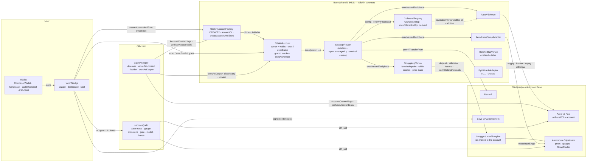

# Architecture — Base-first v1

What is in the tree on 2026-09-05 and what enforces each claim. Anything
labelled **plan** is not built. Addresses are only those in
`VERIFIED-BASE-FACTS.md` (read live 2026-09-05 ~01:00 UTC); the one address the
product needs that is not there — the Aerodrome Slipstream SwapRouter — is an
env input that `script/Deploy.s.sol` refuses to run without.

Abbreviations: HF = health factor; LT = liquidation threshold; LTV =
loan-to-value; LP = liquidity provision; APR = annual percentage rate; ABI =
application binary interface; RPC = remote procedure call; TWAP = time-weighted
average price; EOA = externally owned account; EIP = Ethereum Improvement
Proposal.

## The shape

The user's wallet owns an **OilskinAccount** (one EIP-1167 clone per wallet;
EIP is an Ethereum Improvement Proposal). Every position — Aave v3 collateral
and debt, Snuggle-engine LP (liquidity-provision) ids — belongs to that
account. Oilskin's other contracts are **peripherals** the account calls; they
instruct the account, hold nothing, and have no admin. Off-chain, a **keeper**
watches each account's Aave health factor (HF) and may act only inside a grant
the owner signed. The **yield service** decides which pools may be offered. The
**web** encodes exactly the calls below and asks the wallet to sign them.

## Accounts (`contracts/src/account/`)

**OilskinAccount** (511 lines). `owner` is set once by `initialize`, which only
the factory can call and only once (`NotFactory`, `AlreadyInitialized`); the
implementation contract is bricked at construction (`owner = address(1)`).
Three doors:

- `exec(target, value, data)` / `execBatch(calls)` — owner only (`NotOwner`).
  The target becomes the *active peripheral* for the duration of the call.
- `execAsKeeper(calls)` — anyone may call, but each root call must match an
  active grant for `msg.sender` (`NotGranted`), and every ETH value and every
  recognised token operation anywhere in that call's tree — `transfer`,
  `approve`, `increaseAllowance`, `transferFrom`, Permit2 `approve` /
  `transferFrom` — is charged to the grant's per-period budgets
  (`_charge`, `_decodeTokenOp`; `TokenNotBudgeted`, `TokenBudgetExceeded`,
  `ValueBudgetExceeded`). Budgets are computed from **calldata amounts**, never
  balance snapshots, so a rebasing token cannot fool them.
- `execFromPeripheral(calls)` / `execNestedPeripheral(peripheral, value, data)`
  — only the active peripheral, only while an `exec` is in flight
  (`NotActivePeripheral`); nested delegation restores the previous peripheral
  afterwards. This is how a venue makes the *account* `msg.sender` to Aave or
  the engine.

Per-call context (lock, actor, active peripheral, root grant) lives in
transient storage (EIP-1153), so nothing about a call survives the
transaction; re-entry through any door reverts `Reentrancy`. Revert data
bubbles untouched (`_rawCall`). Grants: `grant(keeper, Permission{target,
selector, maxValuePerPeriod, tokenLimits[≤8], period, expiry})`,
`revoke(keeper, target, selector)`, and `revokeAll()` (an epoch bump that
kills every grant — the kill switch). ERC-721/1155 receivers and `receive()`
are implemented. No admin, no upgrade, no fee logic.

**OilskinAccountFactory** (71 lines). `accountOf(owner)` is a pure function of
the factory and owner (`Clones.predictDeterministicAddress`), so the web can
show the account address — and use it as the Permit2 spender — before it
exists. `createAccount(owner)` is idempotent and deploys only that owner's
account; `createAccountAndExec(calls)` deploys the *caller's* account and runs
`calls` as its owner in the same transaction (`AccountExists` if already
deployed). Emits `AccountCreated(owner, account)` — the keeper's discovery
source.

## Venues (`contracts/src/venues/`, interfaces in `src/interfaces/`)

`ICollateralVenue { supply, withdraw, borrow, repay, healthFactor,
liquidationThresholdBps, maxLtvBps, debt, collateral, borrowRateRay, enabled }`.

- **AaveV3Venue** (158 lines) — no storage, no admin. Resolves the pool, data
  provider and oracle through the `PoolAddressesProvider` on every call; reads
  liquidation threshold (LT) and LTV (loan-to-value) from
  `getReserveConfigurationData` at call time — nothing is a constant. `supply`
  is `approve(exact) → Pool.supply(asset, amount, account, 0) → approve(0)`
  (`Peripheral._approveCallReset`), `borrow` is variable-rate with
  `onBehalfOf` = the account, `repay` approves `min(amount, owed)`, `withdraw`
  pays the account. E-mode is not used.
- **MorphoBlueVenue** (99 lines) — a skeleton that reverts `VenueDisabled` on
  every call and reports `enabled() == false`. The live market ids for
  cbBTC/USDC and WETH/USDC were never discovered (`VERIFIED-BASE-FACTS.md`);
  the discovery recipe is a TODO in the source. **Plan**, not a venue.

`ILpVenue { open, increase, close, closeMany, claim, positionsOf, poolTokens,
poolOf }` → **SnuggleLpVenue** (557 lines) over the live MaxFi/Snuggle engine
proxy `0x7D27CDfBFcC878F7E7349e216d44204BFd2AFd55`:

- Every id is minted to the calling account (the account is `msg.sender` to the
  engine); every token movement is instructed back into the account.
- Width is the **total tick span** in `[150, 5000]` (`MIN_WIDTH_BPS`,
  `MAX_WIDTH_BPS`, `InvalidWidth`); delay ≤ 30 days; deadline required.
- A **price band** (`PriceBand{minSqrtPriceX96, maxSqrtPriceX96}`) is required
  on every deposit and every close, checked against the pool's `slot0()` read
  at execution; an unreadable pool reverts `PriceUnreadable`, an absent band
  `BandRequired`, an out-of-band price `PriceOutOfBand`.
- **Refund folding**: after every engine deposit, whatever bounced back is
  re-deposited single-sided in the same transaction (`_fold`); amounts below
  `10^decimals / 1e5` stay in the account (`RefundLeft`).
- **The one fee chokepoint**: `claim` and `close` first collect realised yield
  (`claimStakingRewards`, falling back to `harvest`; a position refusing both is
  `ClaimSkipped`) and take `performanceBps` of the *gain* per token
  (`_takeFee`), paid to `treasury`; then `close` withdraws principal, untaxed.
  `performanceBps` is an immutable capped by `MAX_PERFORMANCE_BPS = 2000`
  (`FeeAboveCap`). A treasury that cannot receive (a B20 block) skips the fee
  (`FeeSkipped`) rather than bricking the exit.
- `closeMany` is per-id try/catch: refused ids come back in `failed`, the rest
  are paid. `positionsOf` enumerates the engine's `userPositions(address,uint256)`
  index getter until the end-of-list revert, whose shape it *measures* with a
  canary probe first (`EnumerationFailed`, `EngineUnreachable`,
  `TooManyPositions` at 512) — "cannot enumerate" is never "owns nothing".

Engine facts the venue is built on (verified on Base 2026-09-03, recorded in
`AUDIT-FINDINGS-2026-09-03.md` Part 1 and `src/interfaces/ISnuggleVault.sol`):
`userPositions(address)` returning an array does **not** exist — only the index
getter; a rebalance re-keys the position to a new id; `withdraw(id, bool)` is
full-close only; fees pay via `harvest` (unstaked) / `claimStakingRewards`
(staked) net of the engine's own 15 % performance fee; `ref` is locked to the
first depositor's referral (the venue passes `treasury`).

## Registry (`contracts/src/registry/CollateralRegistry.sol`, 142 lines)

`Ownable2Step`; the only owned contract. `register(asset, venue, priceFeed,
enabled, note)` reads decimals from the token, and an enabled asset's venue
must be enabled and must report a non-zero LT for the asset
(`VenueDoesNotKnowAsset`). `maxOfferedLtvBps(asset) = floor(LT ×
1e18 / entryHfFloorWad)` capped at `MAX_OFFERED_LTV_CAP_BPS = 5000`, 0 if
disabled — derived at call time, never typed. `entryHfFloorWad` (set from
`packages/shared` `ENTRY_HF_FLOOR = 1.55`) is bounded to (1, 10]. At the
2026-09-05 read (LT 78.00 % cbBTC, 83.00 % WETH) both derive to the 5000 cap;
cbZEC is registered with `enabled = false` and the note "no collateral market
on Base yet", which the UI shows verbatim.

## Router (`contracts/src/router/StrategyRouter.sol`, 303 lines)

Stateless: immutable `REGISTRY`, `LP_VENUE`, `SWAP`, `PERMIT2`, `USDC`; no
owner; no fee; `_assertHoldsNothing` for the collateral asset and USDC at the
end of every call (`RouterHoldsBalance`). Called only *by* an account
(`msg.sender` is the account; an EOA — externally owned account — calling it
reverts because the account callbacks fail).

- `openLeveragedLp(OpenParams)`: deadline → asset enabled and venue enabled
  (`AssetDisabled(asset, note)`, `VenueDisabled`) → the pool must contain USDC
  (`PoolWithoutUsdc`) → optional Permit2 pull to the account (`_pull`; empty
  signature = the account already holds the collateral; `collateralAmount = 0`
  = borrow against collateral already supplied) → `venue.supply` →
  `venue.borrow(USDC)` → **post-borrow HF must be ≥ `entryHfFloorWad`**
  (`EntryHfTooLow`) → `lpVenue.open` single-sided in USDC with the caller's
  band, width, delay, auto-compound.
- `unwind(UnwindParams)`: works on **disabled** assets (exits are never gated)
  → `closeMany(ids, band)` (all in one pool) → swap the non-USDC leg to USDC
  through the adapter with the caller's `swapMinOut` and route data → repay
  (`max` = `min(debt, USDC held)`) → withdraw (`max` = all) → if debt remains
  after a withdraw, HF must be ≥ the floor (`ExitHfTooLow`).
- `sweep(tokens)`: whole balances of the account go to `account.owner()` and
  nowhere else — earnings to the wallet.

`AerodromeSwapAdapter` (79 lines): one Slipstream `exactInputSingle`
from the account to the account; `minOut > 0` (`ZeroMinOut`) and a deadline
are mandatory; allowance exact and reset; `InsufficientOutput` even if the
router lied. Its `ROUTER` address is unverified (see above).

`PythOracleAdapter` (181 lines) is built for the v1.1 Morpho cbZEC market and
**not used by anything in v1**: `price()` reverts unless `refresh(updateData)`
posted a Pyth update in the same transaction (`NoUpdateInTx`), reads with
`getPriceNoOlderThan(maxAge)`, and reverts `PegBreak` when the Aerodrome
cbZEC/USDC pool TWAP (time-weighted average price) deviates from Pyth ZEC/USD
by more than `maxDeviationBps`.

## Keeper (`agent/`, 3,437 source lines, viem)

`src/keeper.ts` wires the loop; `src/index.ts` is the process entrypoint.

1. **Discover** accounts from the factory's `AccountCreated` logs, windowed
   from `DISCOVERY_FROM_BLOCK`, cursor persisted per window
   (`services/discovery.ts`); the persisted registry is authoritative across
   restarts.
2. **Value** each account fail-closed (`engine/valuation.ts`): Aave
   `getUserAccountData` plus one `getUserReserveData` row per reserve
   (cbBTC, WETH, USDC from shared `AAVE_V3_RESERVES`), the LT per reserve from
   `getReserveConfigurationData`, the Aave oracle price, and an independent
   Chainlink read. Verdicts: `NO_DEBT` / `OK(hf)` / `UNKNOWN`. Four guards, each
   sufficient alone to force `UNKNOWN`: an incomplete snapshot, a zero / stale /
   disagreeing price, reserve rows not reproducing the pool's totals or
   weighted LT, or the recomputed HF disagreeing with the pool's. The ladder
   never runs on `UNKNOWN`; a streak escalates.
3. **Ladder** (`engine/ladder.ts`) over shared `HF_LADDER`: warn < 1.50,
   repay < 1.35, derisk < 1.20, emergency < 1.05, each disarming at rung + 0.05
   (`HF_HYSTERESIS`); a gap down fires the most severe crossed rung once;
   recovery re-arms per rung.
4. **Plan** (`dispatch/policy.ts`): `repay` closes ⌈⅓⌉ of the account's LP
   ids, `derisk` ⌈⅔⌉, `emergency-unwind` all — as `SnuggleLpVenue.closeMany(ids,
   band)` per pool with the band from the live `poolSqrtPriceX96` ±
   `BAND_TOLERANCE_BPS` — then `StrategyRouter.unwind({positionIds: [],
   repayAmount: max, withdrawAmount: 0})`. The keeper **never withdraws
   collateral** and never passes ids to `unwind` (it cannot set an honest
   `swapMinOut` for a quantity unknown before the close), so the non-USDC leg of
   a closed position stays idle in the account. `warn` is a log line
   (`log.warn("NOTIFY: …")`); the `notify` hook in `keeper.ts` is a
   programmatic option that `index.ts` does not wire to anything.
5. **Dispatch** (`dispatch/keeperDispatcher.ts`): read `grantOf` on-chain for
   every root call → simulate `execAsKeeper` from the keeper address → send →
   confirm. Grant reverts (`NotGranted`, `TokenNotBudgeted`,
   `TokenBudgetExceeded`, `ValueBudgetExceeded`) are `REFUSED` without sending.
   Idempotency key `account:episode:seq:action` from persisted counters,
   written atomically with the ladder state *before* anything is sent
   (`store/keeperStore.ts`: temp-file + fsync + rename, `link()` lock, tamper
   fingerprint). A progress watchdog (`watchdog.ts`) aborts a tick only when no
   unit of work completed for `WATCHDOG_STALL_MS`, then backs off; the process
   never exits on a stall.

**Known seam gap (2026-09-05).** The web's protection grant covers
`StrategyRouter.unwind` only (`web/lib/plan.ts: grantCall`, `encodeGrantWrite`).
The keeper's plan for any account holding LP ids needs a second grant on
`SnuggleLpVenue.closeMany` and checks `grantOf` for it, so with the grant as
the web ships it the keeper is `REFUSED` for LP positions and can only repay
idle USDC. One side must change before launch; see `RISKS.md`.

## Web (`web/`, 6,099 lines under `app/ components/ lib/` excluding the
2,786-line generated ABI)

wagmi 2 + viem + RainbowKit (Coinbase Wallet including Smart Wallet, MetaMask,
EIP-6963-announced wallets; WalletConnect when a project id is set), Base
only. Encoding comes solely from `lib/abi/oilskin.generated.ts`
(`scripts/sync-abi.mjs` from `contracts/abi/oilskin-abi.json`;
`test/abi.test.ts` fails on drift). `lib/plan.ts` builds the exact calls in
`FLOWS.md` and one plain sentence per wallet prompt; `lib/execute.ts` asks the
wallet only after `estimateGas` and an ETH-balance check. The dashboard reads
**from chain** (`lib/reads.ts` `safeMulticall` — viem's Multicall3 with a
per-call fallback; `lib/positions.ts`): Aave `getUserAccountData`, per-reserve
holdings, `SnuggleLpVenue.positionsOf(account)` → engine `positions(id)` →
pool `slot0`. The indexer (`lib/indexer.ts`) is a cache for USD marks and
"cannot invent a position"; the yield service does not serve its
`/v1/account/{owner}` path yet. Demo mode whenever no wallet is connected:
snapshot market pinned to `VERIFIED-BASE-FACTS.md`, gate pinned to
`MODEL-NUMBERS-2026-09-05.md` (`lib/demo-gate.json`), simulated signing.
Spot (`lib/cow.ts`, `app/spot/page.tsx`): CoW `TradingSdk` quote → ERC-20
approve to the vault relayer read from `settlement.vaultRelayer()` → the
wallet signs the order → order-book status polling; Oilskin never holds the
tokens.

## Yield service (`services/yield/`, 3,914 source lines, zero runtime deps)

`sources/aave.ts` reads `getReserveData` + `getReserveConfigurationData` per
reserve with strict word-count decoding (a half-readable sample is refused);
`sources/gauges.ts` reads each Aerodrome pool's gauge via `Voter.gauges(pool)`,
`rewardRate()`, `periodFinish()`, `slot0()`, `stakedLiquidity()` and converts to
the marginal in-range emissions APR per shared width preset; `gate.ts` /
`model.ts` decide `qualifies ⇔ lpNet > aaveUsdcBorrowApr` with thirteen named
refusal reasons and `lpNet = (1 − e^{−x})(r/x − 1)`, `x = σ²/(4·f(w))`
(validated against the Monte Carlo in `scripts/lp-sim.py`). `stale` is derived
at serve time from `sampledAt`; `/v1/gate` and `/v1/band` answer 503 on absent
or stale rates. Empirical bands come from the engine's own closed-position
history (`YIELD-SERVICE.md`). The verdict at the 2026-09-05 borrow read is in
`MODEL-NUMBERS-2026-09-05.md`: nothing clears.

## Shared (`packages/shared/`, 1,499 lines, zero deps)

`base.ts` (every address, checksummed, asserted unique; `CHAINLINK_ZEC_USD =
null`; `MORPHO_BLUE.marketIds = {}` and `COW_PROTOCOL.vaultRelayer = null` on
purpose — unverified), `health.ts` (`ENTRY_HF_FLOOR`, `HF_LADDER`, `rungFor`
throws on NaN — fail closed), `collateral.ts` (`COLLATERAL_ASSETS`, cbZEC
`enabled: false` + reason; `maxOfferedLtvBps`, `ltvPresets` 30 / 40 / top =
min(5000, floor(LT/1.55))), `fees.ts` (`FEES.performanceBps = 1000`,
`maxPerformanceBps = 2000`, `orchestrationBps = 0`), `width.ts`
(`RANGE_WIDTH_BOUNDS {150, 5000}`, presets 4500 / 1500 / 300 and correlated
2356 / 784 / 150, `halfWidthFromBps` geometric), `pools.ts` (12 engine pools +
the tracked, never-offered cbZEC/USDC pool), `keccak.ts`. The prototypes carry
a byte-equal copy that `prototype/test/verify-toggle.mjs` deep-equals against
the built package.

## What owns what — the trust model in one paragraph

The wallet owns the account; the account owns every position; the registry
owner (a Safe, **plan**) can only change which assets are offered and the
entry-HF floor within (1, 10] — it cannot touch an account, and `unwind`
works on disabled assets. Venues and the router have no owner and no
storage. A keeper key can, at worst, churn within the budgets of a grant the
user signed, and the user can end that with one `revokeAll()`. Oilskin's fee
is the venue's immutable `performanceBps` on realised yield only. The
treasury and the keeper are Oilskin's; everything else is the user's or a
third party's.
