# Architecture

ZEC Yield Orchestrator lets native-ZEC holders earn yield in two modes — Simple
Lending (Rhea Finance supply) and Full Strategy (borrow → Base → MaxFi/SnuggleFi
concentrated liquidity) — with rewards either compounding or returning to the
user's own Zcash wallet as native ZEC.

The system is deliberately thin: every yield-generating mechanism belongs to an
existing protocol (Rhea lending, MaxFi/SnuggleFi LP engines, NEAR Intents
bridging). We orchestrate; we do not re-implement.

```mermaid
flowchart LR
    subgraph User
        ZW[Zcash wallet]
        UI[Web app]
    end

    subgraph NEAR["NEAR · Rhea Finance"]
        MCA[Multi-Chain Account]
        LEND[Rhea lending market\nZEC collateral · borrow USDC/cbBTC/WETH]
    end

    subgraph Intents["NEAR Intents (1-Click API)"]
        I1[deposit address / quote / status]
    end

    subgraph Base["Base · our contracts"]
        PV[PositionVault]
        RR[RewardRouter]
        AD1[MaxFi adapter]
        AD2[SnuggleFi adapter]
        LP[MaxFi / SnuggleFi\nposition managers]
    end

    AGENT[Off-chain agent\nmonitors · decides · executes]

    ZW -->|1 send ZEC| MCA
    MCA --> LEND
    LEND -->|2 borrow, delivered cross-chain| I1
    I1 -->|3 arrive on Base| PV
    PV --> AD1 & AD2 --> LP
    RR -->|claim via vault| PV
    RR -->|rewards → intents deposit addr| I1
    I1 -->|native ZEC| ZW
    AGENT -.-> LEND
    AGENT -.-> PV
    AGENT -.-> RR
    AGENT -.-> I1
    UI --> AGENT
```

## Components

### Base contracts (`contracts/`)

**PositionVault** — per-user LP positions. Receives bridge-delivered capital,
opens positions through whitelisted adapters with the user's exact parameters
(`rangeWidthBps`, `rebalanceDelay`, `autoCompound`), tracks shares, and handles
withdrawals. Invariants:

- Users can always withdraw their own position to their own recipient — the
  withdrawal path is exempt from `pause()`.
- The operator can open/increase/claim but can never move principal to an
  arbitrary address.
- Adapters and entry tokens are owner-whitelisted.

**RewardRouter** — claims rewards (via the vault) and executes the user's
preference: `compound` re-deposits the matching token; `routeToZcash` transfers
to a NEAR Intents deposit address and emits an audit event binding
`(positionId, token, amount, depositAddress, zcashAddress, quoteHash)`.
Per-token per-tx caps bound the blast radius. Principal never passes through.

**ConcentratedLpAdapter** — one deployment per LP engine (MaxFi and SnuggleFi
share underlying contracts; two adapter instances point at their respective
managers). Translates our `ILPAdapter` interface to the engine's ABI, maps
vault positionIds to protocol position ids, holds no idle funds.
`IConcentratedPositionManager` encodes the documented deposit surface and is
marked `FINALIZE_ABI` — reconcile it against the deployed contracts before
mainnet (single-file change by design).

### Off-chain agent (`agent/`)

Zero-dependency Node daemon (stdlib only; vendored keccak verified against
Foundry's `cast`). Three loops:

| Loop | Reads | Decides | Acts |
|------|-------|---------|------|
| health | Rhea HF per strategy | band transitions (1.5 warn / 1.2 critical / 1.05 emergency) | notify → deleverage → unwind |
| lp | vault + adapter state (bare JSON-RPC `eth_call`) | in-range?, accrued rewards | store refresh, feeds reward loop |
| reward | pending rewards, gas, bridge cost | `accrued ≥ max(floor, multiple × costs)` or max-hold override | compound OR quote → verify → routeToZcash → submit tx |

The send-to-Zcash path enforces three safety invariants **before** any on-chain
call: quote recipient == stored Zcash address; destination asset == native ZEC
(`nep141:zec.omft.near`); deposit address well-formed. The emitted `quoteHash`
makes every route auditable against the quote that justified it.

Chain writes intentionally require viem (`integrations/`) — we do not hand-roll
transaction signing. Rhea calls sit behind a `RheaService` interface with a
mock implementation as the default until the SDK is wired.

### Web app (`web/` + `prototype/`)

Next.js 14 app (deposit wizard, dashboard, BFF API stubs) and a dependency-free
single-file prototype (`prototype/index.html`) implementing the same flows with
simulated data. The wizard exposes every product control: mode, amount, borrow
asset + target LTV (with live HF and liquidation-price preview), curated pool
list, range presets (Conservative/Moderate/Aggressive/custom), rebalance delay,
auto-compound, and reward preference.

### Shared package (`packages/shared/`)

Types, verified constants (1-Click endpoints, intents asset IDs, Base token
addresses), the curated pool registry, and range presets — one source of truth
for agent and web.

## Key design decisions

1. **Thin adapters, no LP logic.** Zero-swap rebalancing is the engines' moat;
   re-implementing it would add risk and lag their upgrades.
2. **Single-sided entry.** Curated pools are chosen so the borrowed asset
   enters directly (the engines support single-sided deposits), avoiding an
   extra swap leg and its slippage.
3. **Intents for every cross-chain hop.** ZEC in, borrowed capital across, and
   rewards home all ride NEAR Intents — one bridging model, deposit-address
   based, no custom bridge contracts.
4. **State machine per strategy.** `AWAITING_ZEC_DEPOSIT → SUPPLYING →
   ACTIVE_SIMPLE → BORROWING → BRIDGING_TO_BASE → ENTERING_LP → ACTIVE_FULL`
   is persisted after every step, so a crashed agent resumes instead of
   double-borrowing; Simple→Full upgrade replays the same tail.
5. **Zero-dependency agent core.** Everything testable without a single npm
   package (Node 22 + `node:test`); crypto-sensitive writes are the explicit
   exception and arrive with viem.
