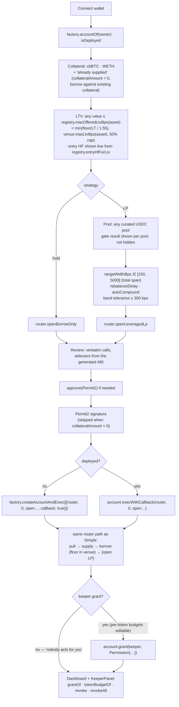
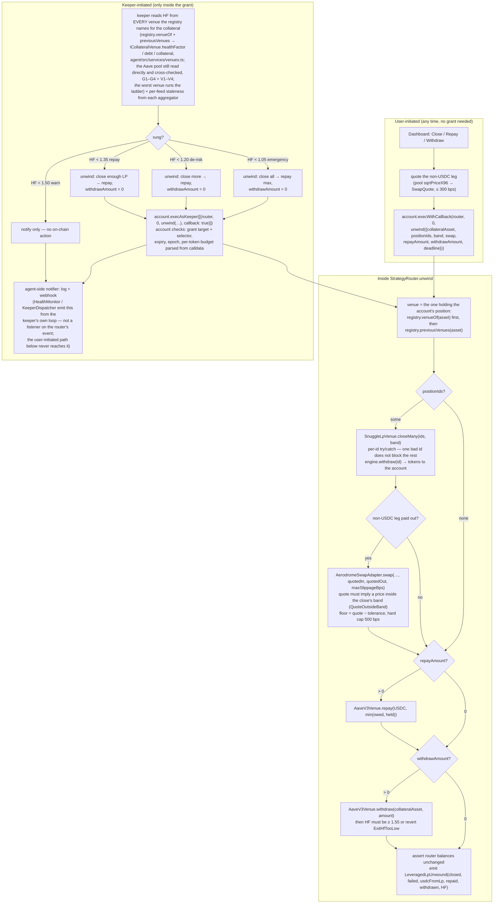

# How a deposit flows — Oilskin v1 (Base-first)

Written 2026-09-07 against the ABI (application binary interface) bundle at
`contracts/abi/oilskin-abi.json` (326 selectors / topics / errors as of 2026-09-08). **Every box below that names a
function is a function in that bundle**; the web encodes exactly these calls
(`web/lib/plan.ts`) and the keeper plans exactly one of them
(`agent/src/dispatch/policy.ts`). Three diagrams: Simple mode, Advanced mode,
and the unwind path (user-initiated and keeper-initiated). A fourth shows where
the money physically sits at every step.

Abbreviations: HF = health factor (collateral value × liquidation threshold ÷
debt; liquidation at 1.0); LTV = loan-to-value; LT = liquidation threshold;
LP = liquidity provision; USDC = the dollar stablecoin borrowed in every
strategy.

## The five things that never change

1. **The user's smart account owns everything.** `OilskinAccount` is a minimal
   clone (EIP-1167) whose `owner` is the connected wallet. Collateral is
   supplied to Aave *by the account*, debt is *the account's*, the LP position
   is minted *to the account*. The router, the venues and the swap adapter hold
   nothing; the router asserts its own balance of every token is unchanged
   at the end of every call.
2. **The account address is known before it exists.** `factory.accountOf(owner)`
   is a CREATE2 prediction, so the very first deposit's Permit2 signature
   authorizes a one-time transfer to an address that is deployed inside the
   same transaction (`createAccountAndExec`) — not a standing allowance; that's
   the separate one-time ERC-20 `approve` in item 3 below.
3. **Nothing moves without the wallet's signature.** One ERC-20 `approve` to
   Permit2 (once), one Permit2 typed-data signature per deposit (exact amount,
   nonce, deadline), one transaction per deposit.
4. **The entry floor is enforced by the venue, not the UI.** `AaveV3Venue.borrow`
   reverts `EntryHfTooLow` below the registry's `entryHfFloorWad()` (1.55). No
   path — Simple, Advanced, hand-built batch — can open under it.
5. **The keeper can do exactly one thing.** The grant names one target
   (`StrategyRouter`), one selector (`unwind`), per-token daily budgets, and an
   expiry (30 days). It cannot open, cannot sweep, cannot change the grant.

## 1. Simple mode — one decision per screen

```mermaid
flowchart TD
    W[Connect wallet<br/>Coinbase Wallet · MetaMask · WalletConnect] --> A0

    A0["factory.accountOf(owner)<br/>predict the account address (CREATE2)"] --> A1{"factory.isDeployed(account)?"}

    A1 -- no --> P0
    A1 -- yes --> P0

    subgraph choose ["Choose (Simple: three picks, everything else preset)"]
        P0["Pick collateral<br/>cbBTC or WETH<br/>cbZEC shown as 'not yet'"]
        P1[Pick amount]
        P2[Pick a risk setting<br/>Sheltered · Balanced · Open<br/>= LTV 30% · 40% · top rung]
        P0 --> P1 --> P2
    end

    P2 --> G{"gate: does any pool<br/>clear borrow cost + drag<br/>+ fees + model uncertainty?"}
    G -- "no (today: nothing clears at 4.83%)" --> H["Recommend HOLD:<br/>router.openBorrowOnly<br/>USDC lands in the account"]
    G -- yes --> L["Recommend LP:<br/>router.openLeveragedLp<br/>preset width + rebalance delay<br/>for the risk setting"]

    H --> R
    L --> R

    subgraph review ["Review — the exact calls, in plain words"]
        R["Every call printed verbatim<br/>with the price at which liquidation starts<br/>and the four keeper rungs"]
    end

    R --> S1{"allowance(collateral → Permit2)<br/>≥ amount?"}
    S1 -- no --> S1a["tx 1: collateral.approve(Permit2, max)<br/>(one time)"]
    S1a --> S2
    S1 -- yes --> S2
    S2["signature: Permit2 PermitTransferFrom<br/>spender = the account<br/>exact amount · nonce · 20-min deadline<br/>(no transaction)"] --> S3

    S3{"account deployed?"}
    S3 -- "first time" --> T1["tx 2: factory.createAccountAndExec(<br/>[{router, 0, open…, callback: true}])"]
    S3 -- "existing" --> T2["tx 2: account.execWithCallback(<br/>router, 0, open…)"]

    T1 --> X
    T2 --> X

    subgraph router ["Inside tx 2 — StrategyRouter (stateless)"]
        X["registry.isEnabled(asset) · venueOf(asset)<br/>LP pool must contain USDC"] --> X1
        X1["Permit2.permitTransferFrom<br/>collateral: wallet → account"] --> X2
        X2["AaveV3Venue.supply(asset, amount)<br/>onBehalfOf = account"] --> X3
        X3["AaveV3Venue.borrowAgainst(asset, USDC, borrowAmount)<br/>(borrow(USDC, amount) when collateralAmount = 0)<br/>reverts EntryHfTooLow if HF &lt; 1.55"] --> X4{hold or LP?}
        X4 -- hold --> X5["done: USDC sits in the account"]
        X4 -- LP --> X6["SnuggleLpVenue.open(poolId, USDC single-sided,<br/>width, delay, price band, deadline)"]
        X6 --> X7["engine.depositSingleSided → NFT id minted to the account<br/>any bounce folded single-sided in the same tx"]
        X5 --> X8
        X7 --> X8
        X8["assert router balances unchanged<br/>emit BorrowOnlyOpened / LeveragedLpOpened"]
    end

    X8 --> K{"protect with the keeper?<br/>(Simple: on by default, explained)"}
    K -- yes --> K1["tx 3: account.grant(keeper, Permission{<br/>target: router, selector: unwind,<br/>tokenLimits, period 1 day, expiry 30 days,<br/>allowCallback: true})"]
    K -- no --> D
    K1 --> D["Dashboard: position, HF, rungs,<br/>'nobody acts for you unless you granted it'"]
```

What the user sees at each step in Simple mode is one sentence and one button;
the risk (liquidation price, penalty, keeper limits) is printed *before* the
button, never after. The gate result is shown honestly: when no pool clears,
Simple recommends holding USDC and says why.

## 2. Advanced mode — same calls, more knobs

Advanced does not add a single new contract call. It exposes the parameters
Simple presets, and it lets the user skip the keeper.

Advanced-only affordances that exist in the ABI: `account.revoke(keeper,
router, unwind)` and `account.revokeAll()` (bumps `grantEpoch`, killing every
grant at once); `account.execBatch([...])` for a claim
(`SnuggleLpVenue.claim(ids, band, deadline)` then `router.sweep(tokens)` to the
owner wallet, both with `callback: true`); `SnuggleLpVenue.increase` for adding
to an existing LP id (mints a new id — the engine has no increaseLiquidity).

## 3. Unwind — the user's path and the keeper's path

Both paths call the same function with the same shape; the difference is who
signs and what the grant permits.

Hysteresis: a rung clears only when HF recovers by +0.05 above it, so the
keeper does not oscillate. The warn rung produces a message and nothing else —
no permission produces it. If the keeper is down or the grant has lapsed,
nobody acts; the user can always unwind from the dashboard.

The agent-side notifier above talks to the founder's ops channel only —
nothing in this diagram relays it to the account owner. The owner's own
visibility shipped separately (`NotifyBanner`, `web/components/NotifyBanner.tsx`,
Step 3): whenever the dashboard is open it independently recomputes the same
`HF_LADDER` (`@zyo/shared`) against the live on-chain HF the dashboard already
reads, and shows/alerts locally — no ABI call of its own, no relay from the
keeper, so it is UI only and not a node in this diagram (see
`docs/ARCHITECTURE.md` "Owner notifications (v1)" for the full comparison and
why in-app is v1's only owner channel). Separately, `agent/src/notify/ownerNotifier.ts`
records the same rung history per account durably on the keeper side — a seam
for a future delivery channel, not a delivery channel itself yet.

## 4. Where the money sits

| Step | cbBTC / WETH | USDC | LP NFT |
|---|---|---|---|
| before | wallet | — | — |
| after `approve(Permit2)` | wallet (allowance only) | — | — |
| after Permit2 signature | wallet (signature only) | — | — |
| inside tx 2, after `permitTransferFrom` | **account** | — | — |
| after `AaveV3Venue.supply` | Aave aToken, held by the **account** | — | — |
| after `AaveV3Venue.borrow` | Aave (collateral) | **account** (debt = account's) | — |
| hold: end of tx 2 | Aave | **account** | — |
| LP: after `SnuggleLpVenue.open` | Aave | in the engine position (staked in the Aerodrome gauge) | minted to the **account** |
| after `unwind` | Aave, or wallet if withdrawn and HF ≥ 1.55 | repaid to Aave; remainder in the account | burned / closed |
| after `claim` + `sweep` | — | rewards (AERO) and USDC swept to the **wallet** | — |

Nothing ever sits in the router, a venue, the swap adapter, or any address
Oilskin controls. The one exception the user must understand: the LP position
is inside the MaxFi/Snuggle engine, a third-party contract with its own owner
powers (`docs/RISKS.md` §16), and rewards accrue there until claimed.

## 5. What is deliberately not in the diagram

- cbZEC as collateral (no lending market exists; `CollateralRegistry` has it
  registered `enabled: false`).
- Depositing INTO `MorphoBlueVenue`: the venue is built and tested against the
  two verified Base markets (`docs/VERIFIED-BASE-FACTS.md`), but the registry
  points cbBTC and WETH at Aave until the owner runs `proposeVenue` → timelock
  → `acceptVenue`; the venue refuses a supply before that.
- Spot buy/sell via CoW (a separate page, no account involvement).
- Any path that constructs, signs or broadcasts on the user's behalf — there is
  none.
