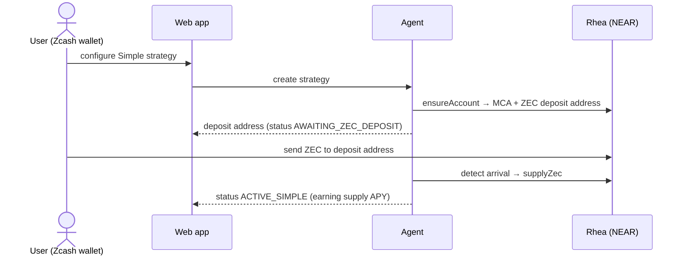
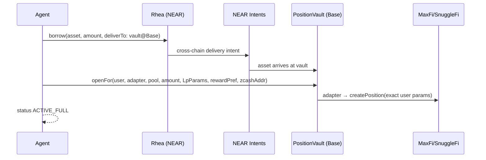
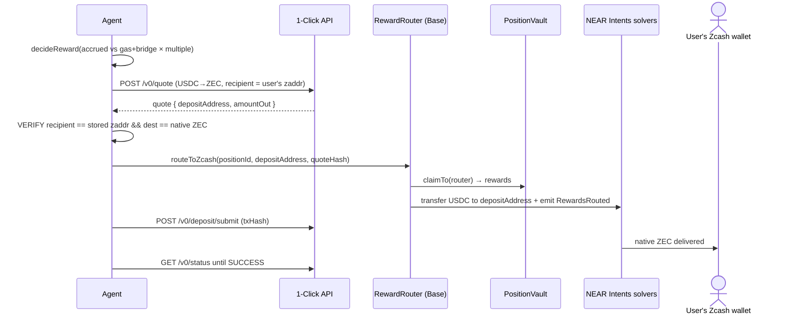
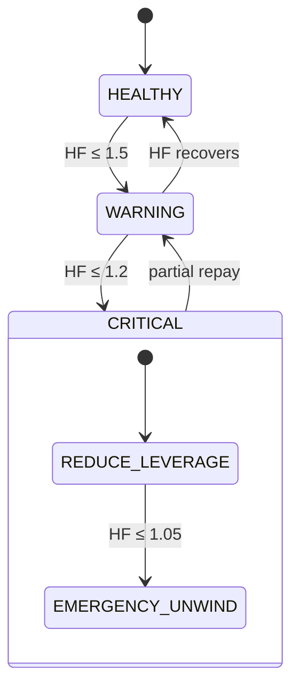

# Flows

## 1 · Simple deposit

## 2 · Full strategy deposit (continues from step 1)

Simple → Full upgrade is exactly this flow run later against an existing
`ACTIVE_SIMPLE` strategy (`UpgradeExecutor`), with idempotent persisted steps.

## 3 · Reward → native ZEC

Compound preference short-circuits after `decideReward`: `RewardRouter.compound`
claims and re-deposits the matching token in one transaction.

## 4 · Health-factor protection

WARNING notifies. CRITICAL withdraws a slice of the LP position, bridges back,
and repays (deleverage). EMERGENCY_UNWIND exits the LP leg entirely and repays
to a safe HF. Only band *transitions* alert — no repeat spam.

## 5 · Withdrawal

Position owner calls `vault.withdraw(positionId, shareBps, recipient)` — never
pausable, never operator-gated. `recipient` may be the user's Base address or a
1-Click deposit address to route straight back to native ZEC. Rhea-side
collateral withdrawal reverses supply via the agent once debt is cleared.
