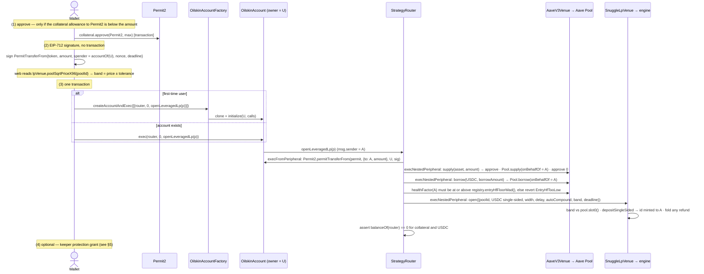

# Flows — the exact calls the user signs

Every flow below is what `web/lib/plan.ts` builds and `web/lib/execute.ts`
runs, encoded from `contracts/abi/oilskin-abi.json` (`web/test/abi.test.ts`
fails on drift), and what the contracts then do. The wallet is asked to sign
only after `estimateGas` and an ETH-balance check pass and the chain id is
8453 (`execute.ts: guardedWrite`). Nothing is signable until
`NEXT_PUBLIC_OILSKIN_FACTORY` / `_ROUTER` point at a deployment
(`plan.ts: planIsSignable`), and there is no deployment yet.

Abbreviations: HF = health factor, LT = liquidation threshold, LTV =
loan-to-value, LP = liquidity provision, EIP = Ethereum Improvement Proposal.
NFT = non-fungible token (the engine's position id).

## 0 · Before anything: the account address

`factory.accountOf(wallet)` (`OilskinAccountFactory`, CREATE2 prediction) is
read first. It is the Permit2 **spender** the user signs for and the address
every position will belong to, whether or not it has been deployed.

## 1 · Deposit — leveraged LP



`OpenParams` (`StrategyRouter.sol`): `collateralAsset`, `collateralAmount`,
`permit{nonce, deadline, signature}`, `borrowAmount` (> 0), `poolId`,
`rangeWidthBps` (total tick span, [150, 5000]), `rebalanceDelay` (seconds),
`autoCompound`, `band{minSqrtPriceX96, maxSqrtPriceX96}`, `deadline`. Web
defaults: deadline 20 minutes, band tolerance 100 bps of price in Simple mode,
up to 300 in Advanced (`plan.ts`). What the chain refuses: an asset that is not
enabled (`AssetDisabled(asset, note)` — cbZEC), a pool without USDC, a width
outside the bounds, a price outside the band, a post-borrow HF below the
1.55 floor, an expired deadline, a wrong-spender or reused Permit2 nonce.

## 2 · Deposit — borrow and hold (no LP)

Same steps (1) and (2). Step (3) is an owner batch, not a router call:

```
account.execBatch([
  { Permit2, permitTransferFrom(permit, {to: account, amount}, wallet, sig) },
  { AaveV3Venue, supply(asset, amount) },
  { AaveV3Venue, borrow(USDC, borrowAmount) }
])                       — or the same list through factory.createAccountAndExec
```

**The entry-HF floor is not chain-enforced on this path.** `EntryHfTooLow`
lives in `StrategyRouter.openLeveragedLp`; the hold batch never touches the
router, so the only on-chain limit is Aave's own LTV cap (73 % cbBTC / 80 %
WETH at the 2026-09-05 read). The web caps the setting at the registry-derived
top (`SettingStep`, shared `ltvPresets`) — a UI guard, not a contract one.

## 3 · Unwind — close, repay, withdraw

Before signing, the web reads the pool's `slot0` tick and `tickSpacing`, sizes
`swapMinOut` for the non-USDC leg from the position's tick value-split × (1 −
tolerance) on the **indexer's USD value** (Simple mode refuses when that cache
is empty; Advanced lets the user enter it), and quotes the band
(`execute.ts: runUnwind`).

```
account.exec(router, 0, unwind({
  collateralAsset, positionIds: [ids in one pool], band,
  swapMinOut, swapRouteData: abi.encode(int24 tickSpacing),
  repayAmount: max, withdrawAmount: max, deadline
}))
```

On chain (`StrategyRouter.unwind`): `SnuggleLpVenue.closeMany(ids, band)` —
each id: collect yield (`claimStakingRewards` → `harvest`), take
`performanceBps` of the gain, then `withdraw(id)`; refused ids are reported in
`failed` and skipped → `AerodromeSwapAdapter.swap(nonUsdcToken → USDC,
amount, swapMinOut, deadline)` (reverts `ZeroMinOut` if the floor is 0) →
`AaveV3Venue.repay(USDC, min(debt, held))` → `AaveV3Venue.withdraw(asset,
all)` → if any debt remains, HF ≥ floor or `ExitHfTooLow`. Works on a
**disabled** asset. Proceeds land in the account; nothing is sent to the
wallet here — see §4 for `sweep`.

Known weakness: if the cache reports a value of 0 for a position that still
holds a non-USDC leg, `runUnwind` falls back to `swapMinOut = 1` — a floor in
name only. Enter the floor yourself in Advanced mode until the leg amounts
are read from the engine's NFT liquidity.

## 4 · Claim — rewards to the wallet

```
account.execBatch([
  { SnuggleLpVenue, claim([ids])  },      // one pool per call (MixedPools); net of performanceBps
  { StrategyRouter,  sweep([AERO, token0, token1]) }   // whole balances → account.owner()
])
```

`sweep` can pay only `IOilskinAccount(msg.sender).owner()`; it is the single
path from the account to the wallet that the router offers.

## 5 · Keeper protection grant (optional, revocable)

```
account.grant(keeper, Permission{
  target: StrategyRouter, selector: unwind (0xebf64f1c),
  maxValuePerPeriod: 0, tokenLimits: [{USDC, …}, {pool tokens, …}, {AERO, …}],
  period: 86400, expiry: now + 30 days
})
```

Budgets are product-policy caps sized at sign time
(`web/lib/execute.ts: grantTokenLimits`: 2× the borrow in USDC, 2× the
borrow-equivalent in the collateral and each pool token at the snapshot
price, `1e23` = 100,000 AERO per day) — sized, not derived from a quote. `revoke(keeper,
router, unwind)` or `revokeAll()` ends it; either is an owner transaction.

**Gap:** the keeper's plan for an account with LP ids starts with
`SnuggleLpVenue.closeMany`, which needs its own grant (`agent/src/dispatch/
policy.ts: grantsNeeded`); the web does not ask for it. See `RISKS.md`.

## 6 · Keeper action — what the keeper sends

The keeper signs nothing on the user's behalf; it sends its own transaction to
the user's account (`agent/src/dispatch/keeperDispatcher.ts`), after reading
`grantOf` for every root call and simulating from its own address:

```
account.execAsKeeper([
  { SnuggleLpVenue, closeMany(ids_k, band) },   // ⌈⅓⌉ / ⌈⅔⌉ / all of the ids, per pool; band = live price ± BAND_TOLERANCE_BPS
  { StrategyRouter,  unwind({ positionIds: [], repayAmount: max, withdrawAmount: 0, … }) }
])
```

The account charges every token operation in that tree to the grant's
budgets (`OilskinAccount._charge`) and reverts `NotGranted` /
`TokenNotBudgeted` / `TokenBudgetExceeded` otherwise. Collateral is never
withdrawn by the keeper (`withdrawAmount: 0`); the non-USDC leg of a closed
position stays in the account. The `warn` rung produces a log line and a
store record only.

## 7 · Spot — CoW Protocol (Advanced mode)

1. `TradingSdk.getQuote({kind: SELL, owner, sellToken, buyToken, amount,
   slippageBps})` (`web/lib/cow.ts`).
2. If `allowance(sellToken, owner → vaultRelayer) < amount`:
   `sellToken.approve(vaultRelayer, amount)` [transaction], with
   `vaultRelayer` read from `GPv2Settlement.vaultRelayer()` — not typed.
3. The wallet signs the EIP-712 order (`postSwapOrderFromQuote`); the order is
   posted to the CoW order book.
4. `getOrder(orderUid)` polled: `open → fulfilled | expired | cancelled`. An
   unfilled order expires with nothing spent. Oilskin never holds the tokens.
   Slippage is bounded [10, 300] bps with a warning above 100 (`SLIPPAGE_*`).

cbZEC is one of the four spot tokens; its address is pinned and any other
`0xb2000…` address is flagged counterfeit (shared `classifyCbZecAddress`).
Exercised only in demo mode so far (no wallet in the build container).

## 8 · The user can always leave without Oilskin

Every position is the account's, and `exec` is owner-only with no other gate:
`account.exec(AavePool, withdraw(...))`, `account.exec(engine, withdraw(id,
false))`, `account.exec(token, transfer(wallet, amount))` all work with no
router, no venue, no registry state and no grant — the property
`invariant_userCanAlwaysExitViaExec` in `contracts/test/invariant/Invariants.t.sol`
checks under random sequences, a glitching engine and a disabled asset.
