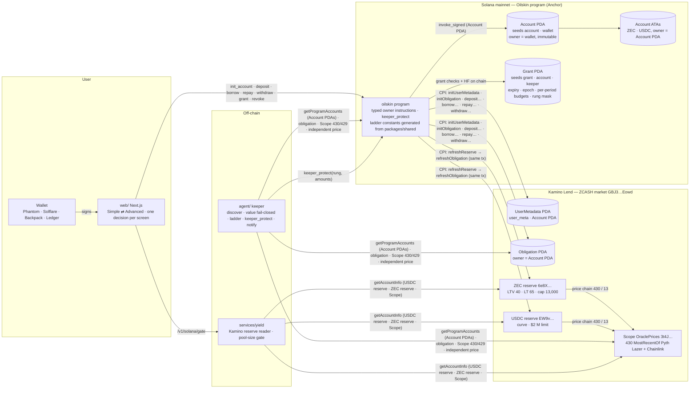

# Solana module — architecture (design record, 2026-09-12; program and keeper built and proven on localnet the same day)

What the Solana module is, account by account and instruction by instruction, before a line of handler code
exists. Every number here comes from `VERIFIED-SOLANA-FACTS.md` (read live 2026-09-12) or from
`packages/shared`; anything labelled **decision** is the founder's to make and is collected in §12. The Base
module's design (`ARCHITECTURE.md`) is the reference for every choice below: where the Solana design departs from
it, the departure and its reason are stated.

**Status (2026-09-12, night).** The founder read this document, decided §12, installed the toolchain and
started the localnet; the gate on handlers is lifted. **Built and proven on localnet (26/26):** every owner
instruction in §3 and `keeper_protect`, the ladder walked by the Scope mock (repay-only inside the repay band at
HF 1.125, the sale path inside the de-risk band at HF 1.07 — the 1.25 floor's ladder since 2026-09-12), and the
**keeper process** (§5, `agent/src/solana/`): discovery by program-account scan,
valuation from one simulated refresh, the repay-only plan from the Account's idle USDC and the funded sale inside
Kamino's cap, the signed transaction landing, the delegated ZEC collected, observe-only refusing by name
(`solana/tests/keeper.spec.ts`, 5). **Cannot be built:** `release_obligation` (§3, §12 (3)). **Not yet
built:** the pool-size gate (§7), the web flow (§8); nothing is deployed and no keeper runs anywhere. Three facts
the program run established and the code now embodies: klend marks a reserve stale after every state change, so
a post-action health view refreshes the reserves again before the obligation; klend **closes an obligation a
full withdraw empties** (rent back to the Account PDA), so `deposit` re-creates it on the same PDA; and on this
market Kamino's own 40 % LTV cap binds before Oilskin's 1.25 floor on both `borrow` and `withdraw` (HF at the
cap is 1.625; the floor would bind at 52 % LTV on ZEC's 65 % LT), which makes the floors defense in depth —
proven by host unit tests, not by the venue. There is no product-wide LTV cap under the venue's since 2026-09-12
(BUILD-PLAN D7): the floor and the reserve's own LTV are the only two ceilings. One fact
the keeper run added: the same cap binds a **sale** too — collateral cannot leave above 40 % LTV, so a sale that
repays and releases in one instruction lands the position at HF 1.625, above every disarm level; the keeper
sizes the sale to whichever of the two (our disarm level, Kamino's cap) needs more ZEC, and says which.

Abbreviations: HF = health factor; LT = liquidation threshold; LTV = loan-to-value; PDA = program-derived address
(an account controlled by a program rather than a key); CPI = cross-program invocation (one Solana program
calling another); ATA = associated token account (the canonical token account for a wallet and a mint); SPL =
Solana Program Library (the token standard); CU = compute units (Solana's gas); APR = annual percentage rate;
TWAP = time-weighted average price; RPC = remote procedure call; MPC = multi-party computation.

## 0 · What it is, and what it is not

It is the Solana twin of `OilskinAccount` + its keeper grant: a **program-owned Kamino obligation** whose
authority is a PDA the user's wallet owns, so that (a) the user, and only the user, can deposit, borrow, repay,
withdraw and leave, and (b) a keeper the user delegated can act *inside the ladder's rungs only*, with amounts
bounded per period, revocable in one transaction. The venue is Kamino Lend's **ZCASH market**; the collateral is
**bridged ZEC** (NEAR Intents / OmniBridge); the debt is **USDC**.

It is **borrow-and-hold**. There is no liquidity-provision leg on Solana: no Aerodrome, no Snuggle engine, and
nothing modelled for Orca / Meteora (`DIRECTION-2026-09-11.md` §2). The yield gate does not apply; the
**pool-size gate** (§7) does. The loan stays on Solana — the debt, the collateral and the repayment
never leave it; since D6 the borrowed USDC itself may cross to the user's own Base account and back
(§14).

It is **not a port**. Solidity clones with `exec(target, data)` passthroughs do not map onto Solana, where every
instruction names its accounts and the program must know each CPI it makes. The consequence is stated in §3: the
program exposes a *typed* instruction for every Kamino operation the user needs, and the "user can always leave"
guarantee (`FLOWS.md` §8) is delivered by two always-available owner instructions rather than by a generic call.

## 1 · The shape



Two facts about the shape carry over from Base unchanged, and one is new:

1. **The entry floor lives where the debt is created.** `borrow` and `withdraw` in the Oilskin program enforce
   HF ≥ `ENTRY_HF_FLOOR` after the operation (Kamino's own LTV check runs too; ours is stricter). No sequence
   through the program can open debt below the floor. The twin of `AaveV3Venue.borrow` → `EntryHfTooLow`.
2. **The keeper's whole surface is one instruction** (`keeper_protect`), the twin of "one root
   `StrategyRouter.unwind` per pool" — and the web asks the user to sign a `grant` whose shape the keeper's own
   test pins.
3. **New: the ladder is in the program, not only in the keeper.** `keeper_protect` refuses to act unless the
   refreshed on-chain HF is below the rung the keeper names, and refuses to "succeed" unless the action lifted
   HF to the rung's disarm level or exhausted its budget. On Base the rung is decided off-chain and the grant
   bounds only *amounts*; on Solana the chain also checks the *reason*. This is possible because Kamino's
   `refreshObligation` gives the program the venue's own HF inputs inside the same transaction.

## 2 · Accounts (all PDAs of the Oilskin program unless stated)

| Account | Seeds | Fields | Who can change it |
|---|---|---|---|
| **Account** | `["account", wallet]` | `owner` (wallet, set once), `bump`, `grant_epoch: u64`, `obligation`, `created_slot`, `version: u8`, reserved | owner-only instructions; `grant_epoch` bumps on `revoke_all` |
| **Grant** | `["grant", account, keeper]` | `keeper`, `expiry_ts`, `epoch` (must equal `account.grant_epoch` to be live), `period_secs`, `period_start_ts`, `repay_usdc_per_period`, `repay_usdc_spent`, `sell_zec_per_period` (0 = the keeper may never sell collateral), `sell_zec_spent`, `max_sell_slippage_bps`, `allowed_rungs: u8` (bitmask over ladder ids), `bump` | owner: `grant` (create/overwrite), `revoke`; owner: `revoke_all` kills every grant at once |
| Account ATAs | canonical ATA(Account PDA, mint) for ZEC and USDC | SPL token accounts | only the Account PDA signs transfers out, only via owner instructions |
| Kamino **UserMetadata** | `["user_meta", account]` under klend | Kamino's | created once by `init_account` via CPI |
| Kamino **Obligation** | `[tag=0, id=0, owner=account, lending_market, seed1=default, seed2=default]` under klend | Kamino's; `owner` = Account PDA | every mutation is a CPI signed with the Account PDA's seeds |

Rules that carry over from `OilskinAccount`:

- **The owner is immutable.** No transfer-ownership instruction. A lost wallet is a lost account, as on Base.
- **No admin, no fee logic in the account.** The program has no global config account in v1; the ladder and
  the entry rule are compile-time constants generated from `packages/shared` (§6). Changing a rung is a program
  upgrade, which is visible on chain and governed by the policy in §12 (2).
- **Per-call context does not survive the transaction.** Solana has no reentrancy across a transaction boundary
  in the EVM sense, and a CPI cannot re-enter the caller with the same signer (the runtime refuses program
  reentrancy except for self-recursion, which the program does not use). No transient-storage twin is needed.
- **Budgets are charged from instruction arguments, never balance snapshots** — the twin of "calldata amounts,
  never balances": `keeper_protect` charges `repay_usdc` and `sell_zec` from its arguments before any CPI. The
  cToken/liquidity exchange rate that Kamino applies on withdraw is not a rebasing surprise for the budget
  because the budget is in ZEC liquidity units the instruction names.

What is different, and why:

- **USDC has a freeze authority on Solana** (`7dGbd2…Crar`, Circle). A frozen Account ATA cannot repay from idle
  USDC; the ladder's fallback is collateral sale if the grant allows it (§12 (1)). Copy states it.
- **The obligation belongs to the PDA, not the wallet**, so Kamino's own UI will not show the position as the
  user's. The Oilskin dashboard is the user's view; §3 "release" is the exit hatch that hands the obligation to
  the wallet if the founder decides to offer it.

## 3 · Instruction set

Every owner instruction requires `signer == account.owner`. Every instruction that touches the obligation runs
Kamino's `refreshReserve` (ZEC, USDC) and `refreshObligation` CPIs **first, in the same transaction**, so the HF
the program checks is the HF Kamino would liquidate against at that slot.

### Owner

| Instruction | Args | What it does | Floor / guard |
|---|---|---|---|
| `init_account` | — | creates the Account PDA and its two ATAs; CPI `initUserMetadata` and `initObligation` (tag 0, id 0) with the Account PDA as `obligationOwner` via `invoke_signed` | idempotent by PDA existence; refuses a wallet that is itself a PDA |
| `deposit` | `amount_zec: u64` | wallet ATA → Account ATA; CPI `depositReserveLiquidityAndObligationCollateralV2` | Kamino's deposit limit and 24-h withdrawal cap apply; nothing to add |
| `borrow` | `amount_usdc: u64` | CPI `borrowObligationLiquidityV2` to the Account USDC ATA | **after the borrow: HF ≥ ENTRY_HF_FLOOR (1.25) and LTV ≤ the reserve's own LTV (40 %)**; **the refreshed HF is then recorded as `entry_hf_bps` (2026-09-13, D7 parity — the ladder derives from it, §14.2)** — no product-wide cap under the venue's since 2026-09-12; today that is 40 % and HF 1.625 at the top of the slider |
| `repay` | `amount_usdc: u64` or `u64::MAX` | CPI `repayObligationLiquidityV2` from the Account USDC ATA | — |
| `withdraw` | `collateral_amount: u64` (cToken units) or `u64::MAX` | CPI `withdrawObligationCollateralAndRedeemReserveCollateralV2` to the Account ZEC ATA. `u64::MAX` withdraws **the most Kamino allows** (everything when there is no debt, and then klend closes the emptied obligation) | **after the withdraw: HF ≥ ENTRY_HF_FLOOR unless debt ≤ LOAN_DUST_UNITS** (the twin of the router's exit floor and slice C's one dust threshold) |
| `transfer_out` | `mint, amount: u64` | Account ATA → wallet ATA | owner-only; this plus `repay`/`withdraw` is the always-exit path — no grant, no keeper, no Oilskin off-chain component needed |
| `set_base_account` | `base_account: [u8; 32]` | records the user's Base `OilskinAccount` (an EVM address left-padded; zero and a non-padded value refused) as the ONLY `mint_recipient` a burn may name (**2026-09-13, D6 §14.1**) | owner-only |
| `deposit_for_burn` | `amount, max_fee, min_finality_threshold` | refreshes the obligation, computes the reserve the live debt requires on THIS account's ladder (§14.3), refuses `ReserveShort` / `NoBaseAccount` / `InsufficientUsdcToClose`, then one CPI into Circle's TokenMessengerMinterV2 with the Account PDA as the burn authority (`cctp.rs`; every CCTP account by address, the denylist entry and the event authority derived) — native USDC burned, the message Circle attests written to the caller's fresh event account (**2026-09-13, D6 §14.4**) | owner-only; rides a v0 transaction with an address lookup table (the account list is over the legacy size) |
| `close_position` | `min_zec_out: u64` | `repay(MAX)` then `withdraw(MAX)` in one instruction; the "unwind" | refuses if the Account USDC ATA cannot cover the debt (the user tops up first) |
| `grant` | `keeper, expiry_ts, period_secs, repay_usdc_per_period, sell_zec_per_period, max_sell_slippage_bps, allowed_rungs` | creates or overwrites the Grant; **a re-grant inside a live period carries spend forward** (Base's rule) | refuses `expiry ≤ now`, `period == 0`, an empty rung mask, a zero repay budget, slippage > 500 bps |
| `revoke` | `keeper` | kills that Grant (`expiry = 0`); refuses a Grant that never existed, so a watcher can tell a kill switch from a no-op | — |
| `revoke_all` | — | `account.grant_epoch += 1`: every Grant issued before is dead | — |
| ~~`release_obligation`~~ — **impossible on klend** (verified 2026-09-12) | — | klend's ownership transfer is initiate → **approve by Kamino's global admin** → accept, and its `ownership_transfer_execution_context_checks` refuse the instruction when invoked by CPI or when the transaction carries anything but compute-budget instructions. A PDA can only sign by CPI, so an Account-owned obligation can never be handed to a wallet. The exit hatch is `close_position` + `transfer_out`: no keeper, no grant, no Oilskin off-chain component, only the program being deployed | — |

### Keeper — one instruction (built 2026-09-12)

`keeper_protect { rung_id: u8, repay_usdc: u64, sell_zec: u64 }`, signer = `grant.keeper`.

**Why it repays first and never swaps.** Kamino refuses to release collateral while the obligation's LTV is
above the reserve's cap (`WithdrawTooLarge`), which is exactly the state the ladder acts in — so "withdraw,
sell, repay" cannot exist on this venue, and neither can an in-program swap of collateral. The order is
**repay first, then release what the repayment earned**: the keeper puts `repay_usdc` into the Account's USDC
token account in the same transaction (its own capital, or a klend flash loan it repays after selling), the
program repays it to Kamino, withdraws `sell_zec` of collateral into the Account's ZEC token account, and
approves the keeper as SPL delegate for exactly what arrived — provided `repay_usdc` covers that ZEC at the
Scope price (entry 430) less the grant's slippage allowance. The keeper pulls the ZEC with a later
instruction and sells it wherever it likes. Collateral leaves Kamino only into the Account's own token
account, and leaves that account only under a delegation sized by a payment already received; the keeper's
margin on a sale is bounded by the allowance the owner signed (≤ 5 %). With `sell_zec = 0` the same instruction
is a plain repay from the Account's idle USDC.

Checks, in order, each a named error:

1. Grant live: `epoch == account.grant_epoch`, `now < expiry`, `rung_id` set in `allowed_rungs`.
2. Period roll: if `now ≥ period_start + period`, spent counters reset and `period_start = now` (the view the
   keeper reads applies the same roll, as `grantOf` does on Base).
3. Budgets, charged from the arguments before any CPI: `repay_usdc ≤ remaining`, `sell_zec ≤ remaining`;
   `sell_zec > 0` refused when `sell_zec_per_period == 0`.
4. Refresh: CPI `refreshReserve` ×2, `refreshObligation`; refuse if the obligation's `lastUpdate.stale` or the
   ZEC reserve's price status is not fully checked (`priceStatus` bits, `VERIFIED-SOLANA-FACTS.md`).
5. **The rung is real:** HF (computed in §4) `< LADDER[rung_id].hf_bps`, and `rung_id` is the *most severe*
   crossed rung the grant allows (`RungNotCrossed` if healthier than named, `RungUnderstated` if a more severe
   allowed rung is crossed). `warn` is notify-only and refused (`RungIsNotifyOnly`). The ZEC reserve's price
   status must carry all six of klend's checks (`PriceNotChecked`).
6. Action: (a) repay `repay_usdc` from the Account USDC ATA (CPI), refresh; (b) if `sell_zec > 0`: withdraw
   `sell_zec` (converted to cTokens at the reserve's exchange rate, rounded up, and re-measured as the token
   account's delta), require `repay_usdc ≥ scope_price(430) × delta × (1 − max_sell_slippage_bps)`
   (`SaleBelowFloor`), then SPL-approve the keeper as delegate for the delta.
7. **Outcome check:** HF after ≥ `LADDER[rung_id].disarm_hf_bps`, **or** the repay budget is now exhausted,
   **or** (on a sale) the sell budget is — otherwise `ProtectionIneffective`: an action that changed nothing
   cannot be recorded as a success (Base's "a confirmed action that did not clear its rung re-arms it" becomes
   a chain-level refusal).
8. Event `KeeperProtected { account, keeper, rung, repaid_usdc, sold_zec, hf_before_bps, hf_after_bps }`.

What the keeper can never do, by construction: move any token to any account but the Account's own ATAs and
Kamino; change a Grant; take collateral except under a delegation the program sized against USDC it had
already repaid at the Scope price; act above the rung; act after `revoke`/`revoke_all`/expiry.

## 4 · Health on chain

After `refreshObligation`, Kamino's obligation carries `depositedValueSf`, `borrowedAssetsMarketValueSf`,
`allowedBorrowValueSf` (LTV-weighted) and `unhealthyBorrowValueSf` (LT-weighted), all in Kamino's 2^60
scaled-fraction `Fraction`. The program defines

> `HF = unhealthyBorrowValueSf / borrowedAssetsMarketValueSf` (∞ when debt is zero or dust),

which for one collateral and one debt reduces to `deposited × LT / debt` — the same definition as Base's Aave
HF, with Kamino's own price and LT, so a position Kamino would liquidate at HF < 1 is the position the ladder
sees at 1.0. Kamino's borrow factor (150 % on ZEC, 100 % on USDC) affects only borrowing *ZEC*, which this
market disables; the program still uses Kamino's field rather than recomputing, so any future parameter change
is inherited, not typed. Arithmetic is integer on the `Fraction` bits; HF is compared in basis points against the
generated constants (§6).

Fail-closed twins of Base's G-rules, for the **off-chain** keeper valuation (`agent/`): Scope entry 430 and its
two sources read directly; an independent price (Pyth Hermes ZEC/USD or a Jupiter quote) must agree within
`ORACLE_DEVIATION_BPS`; staleness is measured per source (430's two sources publish every few seconds; USDC's
13 is heartbeat-driven); reserve `priceStatus` must be all-checked; obligation `stale` must be 0; the keeper's
recomputed HF must reproduce Kamino's within rounding. Any failure → `UNKNOWN` → the ladder never runs, exactly as
on Base.

## 5 · The keeper (`agent/`) on Solana — built 2026-09-12

A sibling loop to the Base keeper, not a fork of it: the Base monitor and dispatcher (audited) are untouched;
what is pure is reused, what is chain-shaped is new under `agent/src/solana/`.

**Reused as is.** `engine/ladder.ts` (the shared HF ladder with hysteresis, shape-only), the progress watchdog
and deadline helpers, the notifier with its channels (log, owner history, webhook) and the honest
`personReached` rule, and the crash-safe store — now generic over an **id codec**: the Base store keeps
EVM addresses and 0x hashes, the Solana store keeps base58 keys and signatures, and a store file refuses to
open under the other codec (`store/keeperStore.ts`, `idCodec` in the file).

**New, file by file.**

| File | What it does | Proven by |
|---|---|---|
| `layouts.ts` | Hand-written byte layouts and encoders: `UserAccount` / `Grant` decode, klend `Obligation` / `Reserve` at the verified offsets (facts file), Scope entries, PDAs (Account, grant, obligation, market authority, ATAs), `refresh_reserve` / `refresh_obligation` / `keeper_protect` / SPL transfer encoders, anchor error names | `scripts/verify-solana-idl.mjs` (**77** checks against the committed `solana/idl/oilskin.json`, inside `npm test -w @zyo/agent`); `test/solana-layouts.test.ts` on a mainnet fixture (slot 446,506,191) |
| `reader.ts` | Discovery: `getProgramAccounts` filtered by size and the `UserAccount` discriminator (no cursor — the program's accounts are few and the scan is one call). Valuation input: **one simulated transaction** (`refresh_reserve` ZEC, `refresh_reserve` USDC, `refresh_obligation`) with the refreshed account states returned, so the keeper reads Kamino's own numbers at the current slot and never re-derives interest or prices; the Account's token balances; the grant; the block time. Independent price: Jupiter's quote on mainnet, **declared absent** on localnet | `solana/tests/keeper.spec.ts` |
| `valuation.ts` | Fail-closed rules on that snapshot — S1 obligation refreshed at the simulation slot and not stale; S2 both reserves active, the ZEC reserve's price status carrying all six klend checks; S3 Scope 430 fresh (≤ min(config, the reserve's own max age)), not future-dated, Scope 13 within 10 % of a dollar; S4 the independent price fresh and within 200 bps of Scope (required when a source is configured); S5 the HF recomputed from Scope and the LT agrees with Kamino's within 100 bps; S6 positive values. Anything else is `UNKNOWN` with the reasons named; `NO_DEBT` at or under `LOAN_DUST_UNITS` | `test/solana-layouts.test.ts`, `test/solana-monitor.test.ts` |
| `pair.ts` (2026-09-13, A5.2) | The pair rule and the bridge decision (pure), `BasePairReader` (one `eth_call` on the Base router), `unreadPair` when no Base RPC is configured | `agent/test/solana-pair.test.ts` |
| `policy.ts` | The plan for a fired rung. Target `T` = the rung's disarm HF × (1 + `KEEPER_PLAN_MARGIN_BPS`). **Repay-only** when the Account's idle USDC covers `need = D − C·P·LT / T`. Otherwise a **sale**: `Y` ZEC = max of what reaches `T` and what Kamino's LTV cap needs to let the collateral out; the keeper pays `X = Y·P·(1 − d)` USDC in, `d` ≤ the grant's allowance and ≤ `KEEPER_SALE_DISCOUNT_BPS` (0 by default: fair Scope value); every clamp (grant period budgets, `KEEPER_MAX_SALE_USDC`, the keeper's balance) is applied and named. Refusals by name: no live grant, a rung the grant excludes, discount above the allowance, already above the disarm level, keeper capital short | `test/solana-policy.test.ts` |
| `dispatcher.ts` | Re-values, reads the grant, plans, builds one transaction (compute budget 1.4 M CU, the keeper's USDC transfer when a sale, `keeper_protect(rung, repay, sell)`), signs with the keeper key, **simulates** (a program refusal is classified by anchor error name: `GrantNotLive` / `RungNotAllowed` / `RungIsNotifyOnly` / `UnknownRung` permanent, `RungNotCrossed` / `RungUnderstated` superseding, the rest transient), **persists the signature before broadcast**, sends, confirms, and after a sale **collects** the delegated ZEC into the keeper's own token account in a second transaction. Observe-only dispatcher without a key: warn delivered or `LOGGED_ONLY`, every action `REFUSED` permanently by name | `solana/tests/keeper.spec.ts` |
| `monitor.ts` | The Base tick order — resume pending → head → discover/register → rotated evaluate under concurrency → prune — with the same idempotency record (`account:episode:seq:action`, on disk as `PENDING` before the dispatcher is called), UNKNOWN streaks that escalate at the configured count, the confirmed-but-ineffective re-arm bounded per rung, permanent refusals abandoned instead of retried, `SENT` confirmed on the resume path, and an aborted tick that says so | `test/solana-monitor.test.ts` (8) |
| `config.ts`, `keeper.ts`, `index.ts` | `SOLANA_RPC_URL`, `OILSKIN_SOLANA_PROGRAM_ID` (required), `SOLANA_STORE_PATH` (absolute), `KEEPER_SOLANA_KEYPAIR` (absolute path to a keypair file; **the CLI's default key is refused**; absent → observe-only, which then needs `SOLANA_SIM_PAYER`, a funded pubkey the read-only simulations name), `SOLANA_PRICE_SOURCE` `jupiter` \| `scope-only` (the latter logs a loud localnet-only warning), the freshness/deviation/tolerance knobs, `KEEPER_MAX_SALE_USDC` (0 = never sells), `KEEPER_SALE_DISCOUNT_BPS`, `KEEPER_PLAN_MARGIN_BPS`, the poll/deadline/watchdog/notify timings, `NOTIFY_WEBHOOK_URL`. `runSolanaKeeper(env, opts)` wires it and runs the loop with the Base shutdown pattern; `npm run dev:solana -w @zyo/agent` | `solana/tests/keeper.spec.ts` runs it in-process with `maxTicks` |

**What the localnet run proved (2026-09-12, `keeper.spec.ts`; re-derived the same night for the 1.25 floor's
ladder — warn 1.23 / repay 1.16 / de-risk 1.09 / emergency 1.05, disarm = rung + 0.02).** At $1,000 the position
at Kamino's cap values at HF 1.629 and nothing fires. With the price walked into the repay band (HF 1.125, midway
between repay and de-risk: ≈ $690.6, −31 %) repay fires; the plan is repay-only, ≈ 204.9 USDC of the Account's
idle USDC for an expected HF 1.1859 (the 1.18 disarm level plus the 50 bps margin); the transaction lands, the
grant's `repayUsdcSpent` equals the USDC that left the Account, the keeper's own USDC did not move, and the next
tick fires nothing (warn stays fired under its 1.25 disarm level). With the idle USDC transferred out and the
price walked into the de-risk band (HF 1.07, midway between de-risk and emergency: ≈ $623, −38 %), de-risk fires;
the keeper pays USDC in at fair Scope value, the program repays it and releases ZEC inside Kamino's 40 % cap
(the cap, not the 1.11 disarm level, sizes the sale: ≈ 3.48 ZEC for ≈ 2,165 USDC, the position landing at HF ≈
1.63), every USDC paid reduced the debt, the released ZEC equals the ZEC collected into the keeper's account,
nothing stays delegated, and `sellZecSpent` equals it. The specs type none of these: each price is derived at
run time from the obligation and the ladder's bands, each expected HF from the rung's disarm level.
Observe-only on a fresh store records the next fall and refuses by name with nothing signed. Two departures from this section's original design are now fact: plan sizing is
the analytic `need` / `Y` above, not the Base "⅓ / ⅔ of value" fractions, because Kamino's cap decides how
much collateral can leave; and the sale floor is enforced by the program from Scope, so the keeper passes
amounts, not a `min_usdc_out`.

## 6 · What is shared, and how it is consumed

| Shared source | Solana consumer | Seam that fails on drift |
|---|---|---|
| `health.ts` `ENTRY_HF_FLOOR` (1.25), `HF_LADDER` (= `ladderFor(1.25)`), `hysteresisFor(ENTRY_HF_FLOOR)` (0.02; `HF_HYSTERESIS` is only the scale); `dust.ts` `LOAN_DUST_UNITS` | `solana/programs/oilskin/src/generated/ladder.rs` — u64 basis points, generated by `solana/scripts/gen-ladder.mjs` (committed, like the ABI bundle); no LTV cap constant since 2026-09-12 | `solana/test/ladder-seam.test.mjs` (node:test, no toolchain; runs in CI) and `gen-ladder.mjs --check` |
| `collateral.ts` `maxOfferedLtvBps(LT)` = LT ÷ the floor | web and yield service compute the offer as `min(maxOfferedLtvStopBps(LT_live), reserveLtv_live)`; the program enforces the same two bounds in `borrow` (the floor on HF, the reserve's own LTV on LTV) | `packages/shared/test/solana.test.ts` pins 6500 → 5200 → 4000 |
| `solana.ts` (new): programs, mints, the market, reserves, vaults, Scope indices, klend seeds, a dated snapshot | keeper, yield service, web, `Anchor.toml` clone list, localnet fixtures | `packages/shared/test/solana.test.ts`; the facts reader compares a fresh read against the snapshot and reports drift |
| `web/lib/copy.ts` `BANNED_WORDS`, the acronym rule, the risk list | the Solana onboarding and review copy (§8) | `web/test/copy.test.ts` (extended to the Solana surfaces) |

The keeper and the web select every address by **network**, never by a fallback: `chains.ts`'s
`SupportedChainId` (8453 | 84532) gains a sibling `SolanaCluster` ("mainnet-beta" | "localnet"); a localnet
table exists only so the harness cannot silently read mainnet.

## 7 · The pool view and the rate after this borrow (yield service) — built 2026-09-13

Base's yield service asked "does this pool clear the borrow rate?"; under BUILD-PLAN-2026-09-12 D4/D5 nothing
is gated on profitability any more. Solana's question is therefore the honest one: **what does this borrow do
to the pool, and to the rate the depositor will pay** — shown live, with the slot — and the only refusals are
the venue's own safety conditions, the ones klend would refuse too.

**Source** `services/yield/src/sources/kamino.ts` (zero dependencies, like the rest of the service): one
`getMultipleAccounts` reads the LendingMarket, both reserves and Scope `OraclePrices` at `confirmed`, then
`getBlockTime` for the chain time of that slot. Strict byte decode at offsets computed from klend-sdk 12.0.0's
borsh layouts and checked against two mainnet captures (`VERIFIED-SOLANA-FACTS.md` Addendum 2): the market's
`emergencyMode` / `borrowDisabled` / owner; per reserve the status, LTV, LT, the 11-point borrow curve
(deduplicated, checked sorted and spanning 0–100 %), deposit and borrow limits, both `WithdrawalCaps`, the
utilisation block, the token-info heuristic band and max ages, the Scope feed and chain; Scope entries 430 and
13 with their timestamps. A wrong size, discriminator, market, mint, Scope feed or Scope chain is refused, never
misread. `SOLANA_RPC_URL` turns it on; the refresh cadence and `staleAfterMs` are the service's.

**View** `services/yield/src/solanaBorrow.ts` `evaluateSolanaBorrow({ collateralZec?, amountUsdc?, entryHf? })`,
served at **`GET /v1/solana/borrow[?collateral=<ZEC>&amount=<USDC>&entryHf=<hf>]`**:

| Shown (never a refusal — D4) | From |
|---|---|
| `borrowAprNowPct`, `utilizationNowPct` | the curve at borrowed ÷ (available + borrowed) |
| `borrowAprAfterPct`, `utilizationAfterPct`, `poolSharePctAfter` | the curve re-priced with this borrow added — +$84 K takes today's pool past Base's Aave rate (facts file) |
| `poolAvailableUsdc`, `remainingBorrowLimitUsdc`, `remaining24hBorrowUsdc`, `maxFundableUsdc` | liquidity, the 2 M borrow limit, the per-interval borrow cap; the minimum is what this pool can lend to anyone right now |
| `ltvCapBps` 4000, `liquidationThresholdBps` 6500, `hfAtVenueCap` 1.625 | the reserve's own config |
| `borrowAtChosenHfUsdc`, `borrowAtVenueCapUsdc`, `borrowAtFloorUsdc`, `borrowSuggestedUsdc`, `bindingCap` | the identity debt = collateral × LT ÷ HF; the proposal is the chosen HF (else the floor) inside Kamino's cap and the pool's depth, and `bindingCap` names which one decided (`chosen_hf` / `entry_hf_floor` / `venue_max_ltv` / `pool_liquidity` / `borrow_limit` / `borrow_cap_24h`) |
| `hfAtEntry`, `ltvAtEntryBps`, `liquidationPriceUsd`, `drawdownToLiquidationPct` | for the typed or suggested borrow |
| `remainingDepositZec`, `remaining24hWithdrawZec` | the 13,000 ZEC deposit limit; the per-interval WITHDRAWAL cap an exit would meet |
| `zecPriceUsd`, `usdcPriceUsd`, `oracleAgeS`, `oracleMaxAgeS` | Scope, with its age against the reserve's 180 s |

| Refusal (safety only — §2 of the plan) | Rule |
|---|---|
| `kamino_unavailable` / `kamino_stale` | no sample, or one past `staleAfterMs` — and then NO number is served from it |
| `venue_paused` / `borrow_disabled` / `reserve_not_active` | market `emergencyMode`, market `borrowDisabled`, reserve `status` ≠ 0 |
| `oracle_stale` / `oracle_out_of_band` | Scope 430 older than the reserve's max age at the sample's chain time; ZEC or USDC outside the reserve's own heuristic band ($400–$2,000; $0.98–$1.02) |
| `pool_cannot_fund` / `borrow_limit_reached` / `borrow_cap_24h_reached` / `utilization_limit_reached` | amount > available; borrowed + amount > borrow limit; amount > the interval's remaining cap (reset once the interval has passed, as klend does); utilisation after > the block (off today) |
| `deposit_limit_reached` | supplied + collateral > the deposit limit |
| `entry_hf_below_floor` / `venue_ltv_exceeded` | HF at the typed amount under the floor the program enforces; amount above Kamino's LTV cap |

The disclosures ride with the view by id (`bridged_zec`, `kamino_parameters_mutable`, `usdc_freezable`,
`program_exit_only`, `borrow_rate_moves`, `liquidation_at_chosen_hf`, `forecast_not_advice`); the words are
the web's (§8, copy rules). `/healthz` carries the Kamino sample's slot and staleness, or `not_configured`.

**A correction the bytes forced.** klend's `deposit_withdrawal_cap` counts **withdrawals** of deposits per
interval (deposits subtract — the ZEC reserve's counter reads −111 ZEC after a day of net deposits) and
`debt_withdrawal_cap` counts **borrows** (repayments subtract). So a deposit is bounded by the deposit limit
alone, a borrow by the borrow limit AND the 1 M USDC per day cap, and an exit by the 3,000 ZEC per day cap
— which the view now reports for the close, not for the open.

Tests: `services/yield/test/kamino.test.ts` (8: the captures decode to the facts file; every refusal of a wrong
buffer; the source's two calls with owners checked), `solana-borrow.test.ts` (6: the projection table
recomputed, the identity with the cap named, klend's limits and caps, every safety refusal),
`solana-route.test.ts` (4: the route, 400s, serve-time staleness and the kept last good sample, not
configured). The web flow (§8) consumes this route.

## 8 · The deposit flow (web) — built 2026-09-13, on the demo snapshot and ready for a named cluster

`web/app/solana/new` (five screens, one decision each) and `web/app/solana` (the position and the exit hatch),
beside the Base flow; a "ZEC on Solana" tab. A Solana wallet session (Wallet Standard wallets announce themselves;
no per-wallet adapter list) sits inside the existing providers. Every address comes from `@zyo/shared`; every
instruction is hand-encoded from the committed IDL (`web/lib/solana/idl.generated.ts`, synced by
`web/scripts/sync-solana-idl.mjs`, pinned by `web/test/solana-idl.test.ts` — the ABI seam's twin). The build
names its cluster and program (`NEXT_PUBLIC_SOLANA_CLUSTER`, `NEXT_PUBLIC_OILSKIN_SOLANA_PROGRAM`,
`NEXT_PUBLIC_OILSKIN_SOLANA_KEEPER`, `NEXT_PUBLIC_SOLANA_RPC_URL`); unnamed, the surfaces run on a labelled
snapshot of Kamino's market (`web/lib/solana/demo-borrow.json`, the yield evaluator on the 2026-09-12 capture)
and can sign nothing.

1. **"Your ZEC on Solana is a bridged token."** Kamino's tooltip **verbatim**, rendered as a dated, attributed
   quotation (`web/lib/solana/kamino-wording.json`, held equal to the facts file by test), then Oilskin's
   additions in plain words: the bridge program is upgradeable by its operators and the only minter; Circle can
   freeze USDC; Kamino's market owner can change every parameter; **the way out is through the program**, whose
   upgrade authority is a single key until the Squads hand-over (the S3 finding). Links to `RISKS.md` §22 and
   `PRIVACY.md` §6. One checkbox.
2. **Amount**, beside the pool as it is from `/v1/solana/borrow` (§7): what it can lend today, the rate now, the
   deposit room, each with the slot and age of the read, "snapshot" when it is the demo; a refusal the venue
   would make is shown in plain words.
3. **Health factor** — the Base slider on Kamino's numbers (`web/lib/solana/plan.ts`): debt = collateral × LT ÷ HF
   both ways; the lowest offered HF is **Kamino's own 40 % cap (1.625)**, named as such, above the registry floor
   and above both marks (shown, disabled, with the reason); the rate **after this borrow** and the account's share
   of the pool's debt from the route; the ladder is `ladderFor(entryHf)`, each rung in words for a Kamino
   position; the acknowledgment under the Sheltered mark as on Base.
4. **Review** — every number with its slot, the disclosures the route named by id (words in
   `web/lib/solana/copy.ts`), Oilskin's Solana risk list (the keeper may sell — decision 1; Scope's 180 s; new
   code, unaudited; demo), and the exact transactions to sign, one sentence each.
5. **Sign** — separate transactions (together they exceed Solana's size): `init_account` when the wallet has
   no Account, `deposit`, `borrow`, then `grant` (30 days, per-day budgets sized to this position — the whole debt
   to repay, the whole collateral to sell — 2 % allowance under the Scope floor, every rung). Each refusal is
   decoded to the program's error name and said in plain words. Demo mode says what would be signed and offers
   the wallet button.

**The position page** reads the wallet's Account, its obligation (collateral through the reserve's cToken rate,
debt, Kamino's cached HF with its slot), the token accounts and the grant in one call, recomputes the HF from
Scope's price, shows the liquidation price and the ladder the keeper runs today (the shared one — a
per-position ladder from the recorded entry waits on the program), and offers the two things only the owner can
do: **repay everything and take the ZEC home** (top up USDC if the account is short, `close_position`,
`transfer_out` both tokens — the exit hatch, one button) and **revoke** the keeper.

Not in this build: exercising the signed path against a live wallet (the localnet specs prove the program; the
web's encoders are pinned to the IDL; a wallet-driven run on localnet is the next check) and the cross-chain
forecast (Stream C). **Advanced mode's sell budget of zero is built (2026-09-20):** the review step asks, in
Advanced mode only, whether the keeper may sell ZEC — decision 1's default, yes, is pre-selected; no sets
`sell_zec_per_period` to 0, swaps the "keeper may sell" card for the one that says rungs 3 and 4 then cannot
act beyond idle USDC, and the grant step's sentence says "and nothing else". Simple mode shows no control and
takes the default whatever was chosen before the switch. The position card names a zero budget as the owner's
choice, and the keeper's policy refuses a sale under it by name, not as an exhausted budget. Copy rules:
`BANNED_WORDS` scan the new files; Kamino's quotation is a quotation.

## 9 · Risks specific to this module (for `RISKS.md` §22 and `web/lib/copy.ts`)

1. **Bridge trust path.** Zcash → NEAR (OmniBridge, MPC/TSS custody of the locked ZEC) → Wormhole messaging →
   the Solana bridge program `dahP…CPxe`, whose PDA `["authority"]` is the only minter. Upgradeable by
   `5kx8…Web6` (a PDA; controller not identified).
2. **No shielded privacy** on Solana; the entry from Zcash is transparent at the bridge's deposit address
   (`INFRA-2026-09.md` on NEAR Intents' t-address deposits).
3. **Kamino market owner powers.** `A11E…zMeR` can change LTV/LT/caps/curve/oracle instantly; no timelock is
   visible on chain. Kamino, Scope and Farms are all upgradeable.
4. **Pool depth and concentration.** $358 K borrowable; one borrower is 59 % of the debt; a liquidation of that
   one obligation is a $260 K sale.
5. **Liquidation depth.** $4.5 M across 30 pools; a 400 ZEC sale moves price 0.56 % today; Kamino's bonus 2–7 %
   plus a 50 % protocol cut of it.
6. **Oracle.** MostRecentOf(Pyth Lazer, Chainlink) with a 15 % divergence gate and a two-hour source age;
   reserve max age 180 s; heuristic band $400–$2,000 — a ZEC price outside the band halts the reserve.
7. **USDC freeze authority.**
8. **Keeper dependence** (Base §10 applies) and, new, **compute budget**: a `keeper_protect` with a sale may not
   fit one transaction (§11 measures it).
9. **Oilskin's own program upgradeability** (§12 (2)).
10. **Solana-specific chain risk:** priority-fee spikes during a crash delay the keeper; RPC provider dependence.

## 10 · Audit

A Solana program is audited by different firms than Solidity: **OtterSec, Neodyme, Zellic, Sec3** (and Certora
for formal specs) are the names the founder should request quotes from. Scope of the audit: PDA seed collisions
and bump handling; `invoke_signed` seed exposure; every Kamino CPI's account list (a wrong `lendingMarketAuthority`
or vault is a fund-loss bug); HF math against Kamino's `Fraction`; grant budget parsing and period roll; the
outcome check in `keeper_protect`; the swap floor; the exit hatches; the upgrade authority. Out of scope: Kamino,
Scope, the bridge — third-party code we call, not audit (as `AUDIT-SCOPE.md` says of Aave and the engine).

## 11 · Test plan (localnet; there is no devnet ZCASH market)

`solana/scripts/localnet.sh` starts `solana-test-validator` with the mainnet programs cloned as upgradeable
programs (klend, Scope, Farms) and the accounts cloned (the market, both reserves, their four vaults, the two
cToken mints and vaults, Scope `OraclePrices` + `OracleMappings` + configuration, the ZEC and USDC mints), all
from `SOLANA_TOKENS` / `KAMINO_ZCASH_MARKET` in shared. Two fixtures make it usable:

- **Scope prices go stale in 180 s, and a future-dated timestamp is refused** (verified 2026-09-12: klend
  computes the age with a checked subtraction and returns `MathOverflow`). So the harness loads
  `programs/mock_scope` — LOCALNET ONLY — **at Scope's own program id**; the cloned `OraclePrices` account
  (owner = that id) becomes writable, and the tests stamp entries 430, 429, 13 and 456 with the validator's
  clock before every Kamino-touching call (`stamp_fresh`) and move the ZEC spot and TWAP together
  (`set_price`) to walk the ladder. Kamino never CPIs into Scope, so nothing else changes.
- **The validator must start above mainnet's slot** (`--warp-slot`): klend's `slots_elapsed` is
  `current − last_update.slot` with a checked subtraction, and the cloned reserves carry mainnet slot numbers.
- **ZEC and USDC cannot be minted locally** (the ZEC authority is the bridge's PDA, USDC's is Circle's): the
  fixture rewrites both mints' authorities to test keypairs generated by the harness at run time (never
  committed); USDC minting lets a test cover the interest a full repay needs.

**As run (2026-09-12, 26 passing in 24 s under `anchor test --skip-local-validator`):** `localnet.spec.ts` 4 (the
world), `owner-path.spec.ts` 11, `ladder.spec.ts` 6 (the program's `keeper_protect` at every rung), and
`keeper.spec.ts` 5 — the keeper **agent** itself (§5), run in-process against the same world with a throwaway
keeper key generated under `fixtures/`. The specs time the grant by the **chain** clock (`getBlockTime`), never
the host's: a warped validator runs hours ahead of the wall clock, and the keeper's freshness rules compare
chain time with chain time.

Scenarios as run, mirroring `contracts/test`: init → deposit → borrow at 40 % (HF 1.625) → refuse a borrow at 55 % →
`keeper_protect(warn)` refused (warn is notify-only, no budget) → price into the repay band (HF 1.125, −31 %) →
`repay` lifts to the 1.18 disarm level → into the de-risk band (HF 1.07) → `derisk` → revoke → keeper refused by
name → owner `close_position` → `transfer_out`. Property
tests (Rust, `proptest`): the keeper never exceeds the grant under random sequences; the owner can always exit;
HF after any owner instruction ≥ floor or debt is dust. CU is metered per instruction and recorded in
`TESTING.md`; if `keeper_protect` with a sale exceeds the limit, §12 (1)'s two-instruction variant is taken.

## 12 · Decisions for the founder — DECIDED 2026-09-12

The founder answered all seven on 2026-09-12 after reading this document; the build proceeds on these.

| # | Decision | What it changes below and in the code |
|---|---|---|
| 1 | **Yes — the keeper may sell collateral to repay when liquidation threatens**, to prevent liquidation of the whole position. | Built as "repay first, then release what the repayment earned" (§3), because Kamino will not release collateral while LTV is above its cap. The keeper funds the repayment (its capital or a flash loan) and receives ZEC at the Scope price less the grant's allowance; per-period USDC and ZEC caps and the outcome check bound it. The Simple-mode grant enables it by default; the pre-sign copy says "may repay with its own USDC and take up to M ZEC per day at the oracle price, less at most s %, to stop a liquidation". |
| 2 | **Squads multisig** holds the program's upgrade authority. | Deploy hands the authority to a Squads v4 multisig with a published delay and a watcher; until that handover the deployer key holds it and the copy says so (`RISKS.md` §22). |
| 3 | **Yes** — `release_obligation` exists. | **Cannot be built (verified 2026-09-12):** klend's transfer needs Kamino's global admin to approve it and refuses the initiate step under CPI or with any companion instruction, so a PDA-owned obligation is untransferable. The exit hatch is `close_position` + `transfer_out`, which need nothing from Oilskin but the deployed program. The founder's intent — the user can always leave alone — is met by those two. |
| 4 | **The depositor decides.** Oilskin shows what the borrow rate will be; it does not refuse on rate. | §7's gate refuses only what cannot be funded (`pool_depth_insufficient`, `deposit_cap_reached`, `venue_paused`, staleness); the projected borrow APR after the borrow and the market's concentration are **shown**, never a refusal. Founder's framing: once ZEC can be bridged to Solana and borrowed against there, this is the best Solana-native option. |
| 5 | **No performance fees yet.** | No fee logic in the program or the flow. |
| 6 | Free RPC while building. | Localnet needs none; the public `api.mainnet-beta.solana.com` serves the readers and the clone; a free keyed tier (Helius, QuickNode, Alchemy) goes into `.env` as `SOLANA_RPC_URL` when the keeper needs `getProgramAccounts` reliability. |
| 7 | **One audit, both modules together.** | `AUDIT-SCOPE.md` will list `solana/` alongside `contracts/` when the Solana module reaches parity; the RFP names an EVM firm and a Solana firm, or one that does both. |

The original questions, kept for the record:

1. **May the keeper sell collateral to repay?** Base never withdraws collateral in a keeper plan because USDC
   comes from closing LP. On Solana a hold position has no USDC source but (a) idle USDC the user left in the
   account and (b) a sale of ZEC. Options: *sale off* (the ladder repays only from idle USDC; a user who
   withdrew the USDC is protected only by warnings — the copy must say so); *sale on, bounded* (per-period ZEC
   cap, Scope-priced floor, ≤ 5 % slippage, only at repay/derisk/emergency). Recommendation: **sale on, bounded,
   off by default in Simple mode with a one-sentence opt-in**, because the product is named for the ladder
   acting. Sub-decision if on: in-instruction Jupiter CPI (one tx, CU risk) vs a two-instruction session.
2. **Program upgrade authority.** Solana programs are upgradeable unless the authority is set to none. Options:
   burn after audit (a bug is then permanent, fixed by a new program and migration); or a Squads multisig with
   a published delay and a watcher (the registry-owner shape of `RISKS.md` §16). Copy cannot say "no operator
   powers" under either until the delay is real and announced.
3. **Exit hatch shape.** `close_position` + `transfer_out` always work and need no Oilskin off-chain
   component. Should `release_obligation` (hand the Kamino obligation to the wallet) also exist? It is the
   stronger guarantee but depends on klend's ownership-transfer instructions accepting a PDA initiator (not
   verified).
4. **Pool-size threshold.** "Refuse a borrow priced above Base's live Aave USDC rate" (today +$84 K), or a fixed
   published APR, or a utilisation ceiling (e.g. never above the 90 % kink → +$278 K)? And a concentration cap.
5. **Fees.** There is no LP yield on Solana, hence no performance fee. Nothing in v1, or a small fixed fee on
   `borrow`? Nothing is the honest default until the value is proven.
6. **Keeper key and RPC.** A paid RPC (Helius / Triton / QuickNode) is needed for `getProgramAccounts` and
   priority-fee estimation; the keeper key's custody follows the Base rule (never in a Claude session, never in
   `.env` read by tooling).
7. **Audit firm and budget** (§10), and whether the Solana audit is sequenced after the Base audit or in parallel
   (the direction memo's cost statement stands).

## 13 · Not in this design

The LP leg on Solana (Orca / Meteora / Raydium — not modelled, not gated); the "lite" notify-only variant (rejected); Kamino Multiply (Kamino's own loop product —
Oilskin's difference is the ladder, not the primitive); elevation groups (none active on this market);
Kamino obligation orders (disabled on this market).

## 14 · D6 addendum (2026-09-13) — the loop's Solana side: entry-HF record, per-position ladder, the reserve, `deposit_for_burn`

BUILD-PLAN D6 puts the cross-chain loop in v1 and §13 above had listed moving USDC between chains as another
product; this section is the design that replaces that line. The loan itself still stays on Solana: the debt
stays on Kamino, only USDC moves — out to the user's Base `OilskinAccount` by Circle's CCTP V2 (Cross-Chain
Transfer Protocol) in the deploy direction, back to the Account's USDC token account in the protective
direction. Facts every number here rests on: `VERIFIED-SOLANA-FACTS.md` Addenda 1 and 3. Base's half is
`StrategyRouter.openLpOnly` / `setSolanaRecipient` / `closeLpAndBurn` (BUILD-PLAN A5); the keeper's class is
§14.7; the two-chain runbook is Stream C.

**Built 2026-09-13 (B3.1)** — §14.1–14.4 as written, proven on localnet against the cloned CCTP V2 programs (`tests/crosschain.spec.ts`, 8; the ladder and keeper specs re-derived on the recorded entry; 34 / 34); the keeper's Solana path derives each account's ladder from the record (§14.7's first half). What the run settled that the design had not: the burn's account list needs a **v0 transaction with an address lookup table** (1,422 bytes against the legacy 1,232 — §14.4); Circle's `MessageSent` account is `8 + rent_payer 32 + created_at 8 + Vec<u8>` and its `messageSender` is the Account PDA (the burn authority), so a Base-side check of the sender can pin the Account, not the wallet.

### 14.1 The account learns two things

| Field (carved out of `UserAccount._reserved`, 64 → 24 bytes; the layout length does not change) | Written by | Zero means |
|---|---|---|
| `entry_hf_bps: u64` | `borrow`, as the refreshed health factor right after the borrow — the twin of `StrategyRouter.entryHfWad` (A4). A dust borrow (HF sentinel) leaves it as it was. | no record: the floor's ladder runs and the keeper says so (`ladderForRecorded`'s rule) |
| `base_account: [u8; 32]` | the owner, `set_base_account` — the user's Base `OilskinAccount` left-padded to 32 bytes, the only `mint_recipient` a burn may name | not linked: `deposit_for_burn` refuses `NoBaseAccount` |

Accounts created before this build read both as zero (the reserved bytes were zero) and behave as they did:
floor ladder, no burns. The keeper's decoder (`agent/src/solana/layouts.ts`) reads the two fields at offsets 90
and 98; the IDL seam pins it.

### 14.2 The ladder per position — D7 parity on chain

`keeper_protect` judged every account against the generated floor ladder (1.23 / 1.16 / 1.09 / 1.05), which is
wrong for the positions this market actually admits: Kamino's 40 % cap means entry HF ≥ 1.625, whose ladder is
1.57 / 1.40 / 1.23 / 1.06 with hysteresis 0.06 (`ladderFor` in `packages/shared`). A keeper acting at the
derived rungs would have been refused `RungNotCrossed`. The program now derives the ladder from
`entry_hf_bps` with the same rule, in integers:

```
raw_i   = 1_000_000 + (e_bps − 10_000) × k_i          (units of 0.01 bp; k = 91 / 64 / 36 / 9, generated)
rung_i  = round_to_100bps(raw_i)                      ((raw + 5_000) / 10_000 × 100)
rung_3  = max(rung_3, EMERGENCY_HF_MIN_BPS)            (10 500)
rung_i  = max(rung_i, rung_{i+1} + 100)  for i = 2, 1, 0   (strictly descending, as shared)
hyst    = round_to_100bps(max(200 × 100, 500 × 100 × (e_bps − 10_000) / 5_500))
disarm_i = rung_i + hyst
```

`solana/scripts/gen-ladder.mjs` emits the constants (`LADDER_RUNG_FACTORS_PCT`, `EMERGENCY_HF_MIN_BPS`,
`HF_HYSTERESIS_MIN_BPS`, `HF_HYSTERESIS_SCALE_BPS`, `HF_HYSTERESIS_SPAN_BPS`) beside the floor ladder, and the
seam test walks every entry HF from 1.25 to 3.00 in steps of 0.01 asserting the integer rule equals shared's
`ladderFor` rung for rung. `entry_hf_bps == 0` → the floor ladder (`LADDER`), as before.

### 14.3 The reserve

The USDC that makes rung 2 atomic on Solana (`CROSSCHAIN-LOOP-2026-09-12.md` §3, item 1): with no collateral
change, lifting HF from the repay rung to its disarm level needs

```
R(D, e) = ceil( D × (disarm₂ − rung₂) / disarm₂ )        D = the refreshed debt, e = entry_hf_bps
```

— 4.1 % of the debt at entry 1.625 (1.40 → 1.46). Shared exports the same rule as `reserveFractionFor(entryHf)`
and `reserveUsdcFor(debtUsdc, entryHf)`; the seam test compares. Where it binds:

- `deposit_for_burn` refuses `ReserveShort` when the Account's USDC after the burn would be under R computed on
  the obligation refreshed in the same instruction. With no (non-dust) debt there is no reserve.
- `transfer_out` is **not** gated. The wallet is the same owner on the same chain and the always-exit rule of §3
  stands; moving the reserve to the wallet is the owner's choice, as withdrawing idle USDC is on Base. The
  keeper's valuation reports the shortfall (`reserveShortUsdc`) and the dashboard says that rung 2 is
  cross-chain until it is refunded (a plain SPL transfer of USDC into the Account's token account; no
  instruction needed).
- Rung 2 spends the reserve (`keeper_protect`, repay-only from idle USDC — the instruction built in S3, unchanged).
  It is not replenished automatically; the notifier tells the owner. While it is short, rung 2 is either the
  five-step cross-chain action (§14.6) or the keeper-funded sale the grant already allows (§3).
- The reserve earns nothing (Kamino's supply side is not used for it); the honest cost is in
  `CROSSCHAIN-LOOP-2026-09-12.md` §3.

### 14.4 `deposit_for_burn` (owner-only; the deploy direction)

Accounts: `Borrow`'s set (owner, account, obligation, `account_usdc`, the Kamino context) plus CCTP's
(Addendum 3: `sender_authority_pda`, `denylist_account`, `message_transmitter`, `token_messenger`,
`remote_token_messenger` for domain 6, `token_minter`, `local_token`, the USDC mint, the two CCTP programs, the
messenger's event authority) and `message_sent_event_data`, a fresh keypair the client generates and the owner
pays rent for. Steps, in order:

1. `base_account ≠ 0` else `NoBaseAccount`; `amount > 0`.
2. Refresh reserves and the obligation (the debt now), compute R; require `account_usdc.amount − amount ≥ R`
   else `ReserveShort` (skipped when the debt is dust or there is no obligation).
3. CPI TokenMessengerMinterV2 `deposit_for_burn` with `{ amount, destination_domain: 6, mint_recipient:
   base_account, destination_caller: default, max_fee, min_finality_threshold }`, the Account PDA signing as
   `owner` by `invoke_signed`. `max_fee` and the threshold are the caller's (the web reads Circle's fee API at
   send time — 1 bp Fast today, Addendum 1); the program carries no fee number.
4. Emit `BurnedToBase { account, amount, base_account, max_fee, min_finality_threshold, reserve_required,
   usdc_after }`.

The CCTP program ids, PDAs, seeds, domain ids and the burn's Anchor discriminator come from `packages/shared`
(`cctp.ts`) through `generated/addresses.rs`, pinned by the addresses seam to Addendum 3. **Transaction size:** Kamino's
context (16 accounts, for the refresh) plus Circle's (11) plus the Account's own is more than a legacy transaction
holds, so the client sends a v0 transaction with an address lookup table — Kamino's market table (`4X1u…xu2`,
Addendum 1) plus an Oilskin table holding the CCTP PDAs and the program's static accounts, **created once at deploy
and recorded in `DEPLOYMENTS.md`** (a founder task beside the program deploy; the localnet spec creates its own).

### 14.5 What the Base side records, mirrored

`StrategyRouter.setSolanaRecipient(bytes32)` — the Account's USDC **token account** on Solana (CCTP's Solana
`mintRecipient` is a token account, Addendum 3), written by the owner through the account; `closeLpAndBurn`
always burns to it and reverts `NoSolanaRecipient` without one. So neither chain's burn can be pointed anywhere
but the user's own account on the other chain, whoever holds the key that triggers it.

### 14.6 Who signs what

| Direction | Step | Chain | Signer |
|---|---|---|---|
| Deploy (Solana → Base) | `deposit_for_burn` | Solana | the user's wallet (owner) |
| | Circle attests (Fast ≈ seconds; Standard = Solana finality) | — | — |
| | `MessageTransmitterV2.receiveMessage(message, attestation)` — mints to the user's `OilskinAccount` | Base | anyone (the web, a relayer, the user); the account signs nothing |
| | `StrategyRouter.openLpOnly` — the arrived USDC into Aerodrome | Base | the user's Base wallet (v1) |
| Protect (Base → Solana; rungs 3–4, and rung 2 when the reserve is short) | `StrategyRouter.closeLpAndBurn` — close ids, swap to USDC, burn to `solanaRecipient` | Base | the keeper's Base key under a grant (target router, that selector, a USDC budget) |
| | Circle attests | — | — |
| | `receive_message` — mints to the Account's USDC token account | Solana | anyone (the keeper's Solana key) |
| | `keeper_protect(rung, repay, 0)` | Solana | the keeper's Solana key under its grant |

**Open for the founder (product, not code):** whether the keeper may ALSO perform the deploy-direction
`openLpOnly` automatically. The account's grant bounds tokens and selectors, not a pool or a range, so an
"automatic deploy" grant would let the keeper choose the pool; v1 leaves that signature with the user.

### 14.7 The keeper's cross-chain position class (A5, `agent/`)

A pair is a Solana Account whose `base_account` names a Base account whose `solanaRecipient` is that Account's
USDC token account — mutual, or not a pair (a half-link is reported as such and each chain's single-chain ladder
runs on whatever debt it has). For a pair: the health factor is Solana's (the debt lives there), the ladder is
`ladderFor(entry_hf_bps)`, rung 2 dispatches the Solana repay from the reserve, rungs 3–4 dispatch the Base
`closeLpAndBurn` sized to the repay need plus Circle's fee, then wait for the attestation, deliver on Solana and
repay — a dispatch record that carries the five steps and resumes from any of them (Stream C writes the runbook
for each failing). Valuation adds the Base leg's USDC value for the dashboard and `reserveShortUsdc`.

**Built 2026-09-13 (A5.2), up to the attestation:** `agent/src/solana/pair.ts` — the pair rule (`pairStatus`:
linked / half-linked-solana / half-linked-base / unlinked / unknown) and `bridgeDecision` (rung 2 always on
Solana; rungs 3–4 over the bridge for a linked pair with a Base burner and no burn in flight; *wait* inside the
stall window, the single-chain sale path past it); `BasePairReader` reads `solanaRecipient` on the Base router
(`BASE_RPC_URL` + `BASE_ROUTER_ADDRESS`, read-only) and the account record carries `crossChain`. The Base side:
`KeeperDispatcher.dispatchBurn` / `confirmBurn` (`agent/src/dispatch`) — the `closeLpAndBurn` grant read whole,
the router's recorded recipient checked against the Solana Account's USDC token account (a mismatch is a
permanent refusal), the ids priced by simulating the burn itself, one call per pool sized to the need grossed
up for Circle's fee (`planBurn`, `grossForFee`), the receipt CONFIRMED only when our `BurnedToSolana`, Circle's
`DepositForBurn` and the transmitter's `MessageSent` agree — and the message bytes plus its nonce kept on the
record (`bridge`) for the delivery. The Solana dispatcher takes a `BaseBurner` and routes a linked pair's rung
3–4 through it; the monitor writes the pair on the account and the bridge stage on the record, and hands the
next firing the burn's age. **Built 2026-09-13 (Stream C):** Circle's attestation poll (`attestation.ts`), the `receive_message` delivery
(`delivery.ts`), and the stage machine that drives a rung from burn to delivery one stage per tick; the repay
that follows needs no cross-chain code, because a delivery moves no health factor and the next firing finds the
USDC in the account. The operator's view — the five steps, every failure and what a person must do — is
`docs/CROSSCHAIN-RUNBOOK-2026-09-13.md`. **Still not built:** the burner's production wiring (a process holding
a Base key beside the Solana key) and the address lookup table both cross-chain transactions need, which is a
deploy artefact; until both exist a linked pair's rungs 3–4 take the single-chain path (the keeper-funded sale).

### 14.8 What localnet proves

The two CCTP V2 programs and the five state accounts of Addendum 3 are cloned beside Kamino
(`scripts/localnet.sh`, `Anchor.toml`). The spec opens a position, links a Base account, burns from the Account's
USDC token account and reads the `MessageSent` event account: header domain 5 → 6, body `mintRecipient` =
`base_account`, `amount`, and the USDC supply reduced by `amount`; then proves the refusals by name
(`NoBaseAccount`, `ReserveShort`, not the owner). Nothing is attested on localnet (there is no Circle); the Base
leg runs the same message bytes through the Foundry mock. The receive path on Solana is Stream C's, with a
mocked transmitter (Circle's mint authority is a 2-of-4 multisig, Addendum 3).
